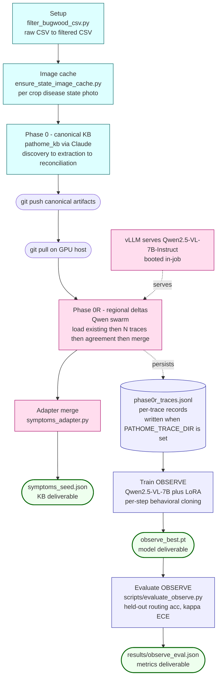
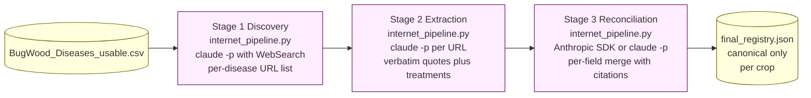
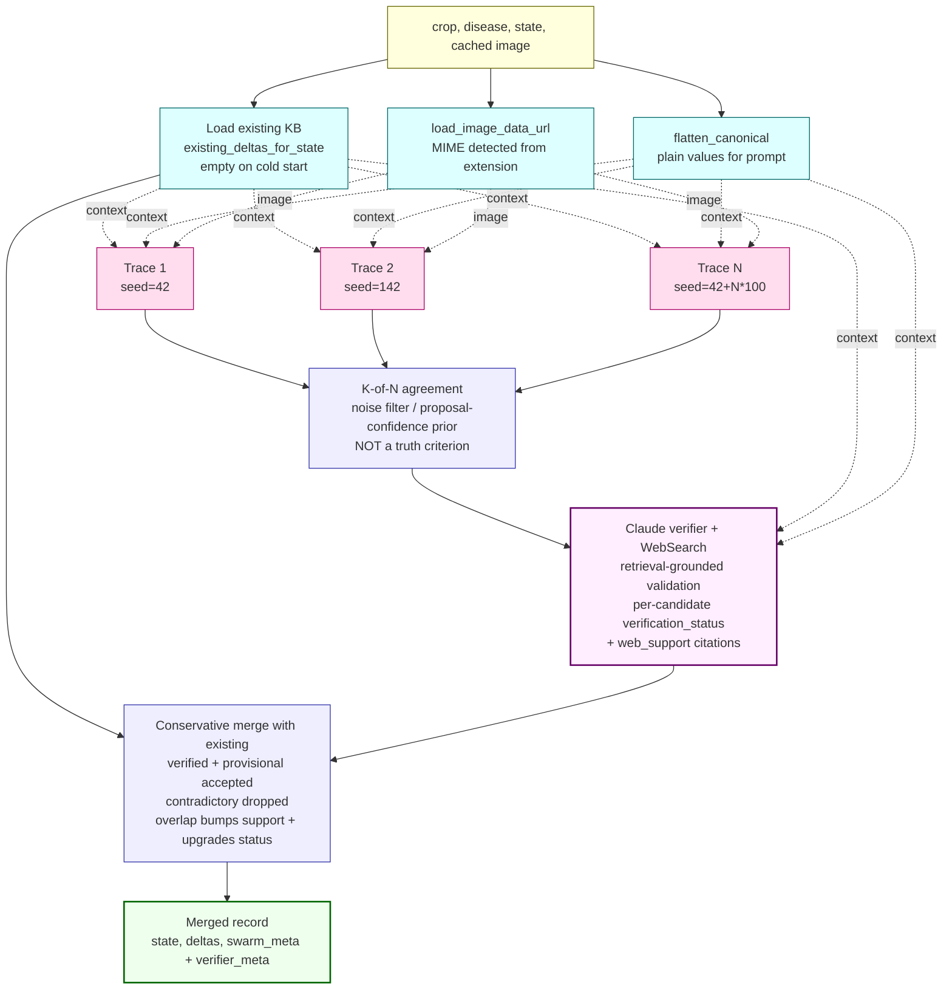
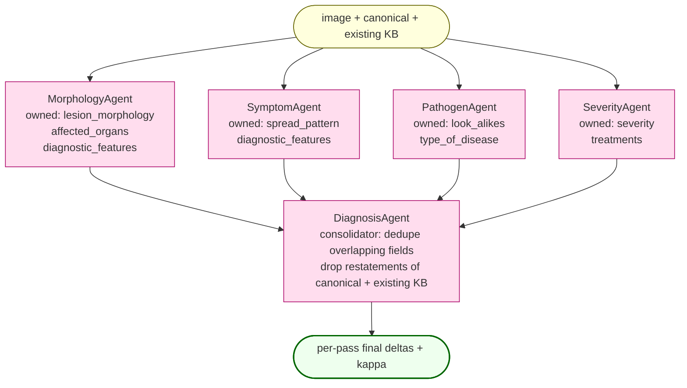
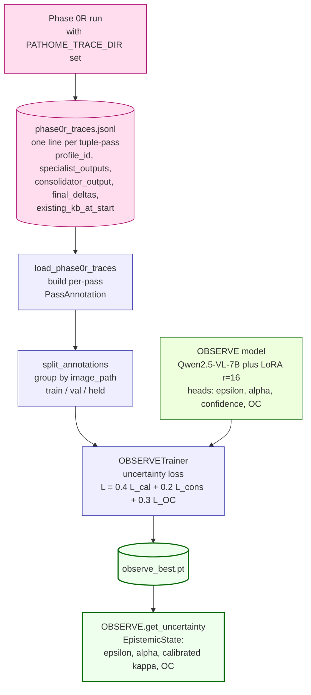

# PlantSwarm — End-to-End Flow

Submission-ready overview of the current pipeline. All flowcharts are
Mermaid (renderable on GitHub, mermaid.live, and any standard Markdown
viewer); data shapes are ASCII for stable layout.

Sections
1. [Top-level pipeline](#1-top-level-pipeline)
2. [Phase 0 — canonical KB (Claude)](#2-phase-0--canonical-kb-claude)
3. [Phase 0R — regional deltas (Qwen swarm)](#3-phase-0r--regional-deltas-qwen-swarm)
   - 3a. [Per-tuple flow (iterative KB loop)](#3a-per-tuple-flow-iterative-kb-loop)
   - 3b. [Inside one trace (routed swarm)](#3b-inside-one-trace-routed-swarm)
   - 3d. [Cross-pass K-of-N agreement filter](#3d-cross-run-k-of-n-agreement-filter)
   - 3e. [Conservative merge with existing KB](#3e-conservative-merge-with-existing-kb)
4. [Phase OBSERVE — distilled student](#4-phase-observe--distilled-student)
5. [Data shape evolution](#5-data-shape-evolution)
6. [File map](#6-file-map)
7. [Env var reference](#7-env-var-reference)
8. [Run-report line](#8-run-report-line)

---

## 1. Top-level pipeline

LOCAL machine → GitHub → GPU host. Three terminal deliverables.



| Stage | Host | Compute | Walltime |
|---|---|---|---|
| Setup | LOCAL or Nova | CPU, &lt; 1 min | trivial |
| Image cache | LOCAL or Nova | network only | smoke ~2 min |
| Phase 0 (Claude) | LOCAL only (OAuth) | CPU + Anthropic API | smoke ~30 min / prod 16-24 h |
| Phase 0R (Qwen) | GPU host with vLLM | 1x A100-80GB | smoke ~20-40 min / prod 10-20 h |
| Adapter merge | Same as Phase 0R | CPU, seconds | trivial |
| Phase OBSERVE (train) | GPU host with CUDA | 1x A100 | ~4-8 h on Phase 0R traces |

---

## 2. Phase 0 — canonical KB (Claude)

Run via `python -m pathome_kb`. Three Claude-driven stages per crop, all
text-grounded (URL + verbatim quote per field). No images touched here.



Output shape (one disease entry):

```jsonc
{
  "disease_name": "Charcoal Rot",
  "pathogen_scientific_name": {
    "value": "Macrophomina phaseolina",
    "url":   "https://extension.umn.edu/.../charcoal-rot-soybean",
    "quote": "Charcoal rot is caused by the soilborne fungus..."
  },
  "type_of_disease":  { "value": "Fungal",  "url": "...", "quote": "..." },
  "affected_parts":   { "value": ["Foliar","Stem","Root","Pod"], "url": "...", "quote": "..." },
  "visual_symptoms": {
    "summary":             { "value": "...", "url": "...", "quote": "..." },
    "diagnostic_features": { "value": "...", "url": "...", "quote": "..." },
    "look_alikes":         { "value": [], "url": "", "quote": "" }
  },
  "treatments":         { "value": [], "url": "...", "quote": "..." },
  "regional_observations": {}
}
```

---

## 3. Phase 0R — regional deltas (Qwen swarm)

Run via `python -m pathome_kb --regional-only`. The orchestrator is
`plantswarm.delta_pipeline.run_for_state`, called once per
(crop, disease, state, cached image) tuple.

### 3a. Per-tuple flow (iterative KB loop with web-grounded verifier)



**Epistemic note.** Multi-run agreement from a single base model is
correlated, not orthogonal evidence — K-of-N agreement filters one-off
hallucinations but does not establish truth. The verifier stage adds
external-evidence support: Claude searches extension factsheets, APS /
CABI references, and peer-reviewed sources, then judges each candidate
against retrieved evidence. The KB therefore evolves like a scientific
observation system: the Qwen swarm is a high-recall **hypothesis
generator**, Claude is a retrieval-grounded **evidence reconciler**.

After every tuple finishes, `_embed_into_registry` merges its per-state
record back into the disease's `regional_observations` dict — **states
not processed this run are preserved verbatim**.

### 3b. Inside one pass (parallel specialists + consolidator)

Each of the N stochastic passes is the same fixed structure: four
specialists run in PARALLEL on (image, canonical, existing KB), then
DiagnosisAgent consolidates the union. No routing, no κ-gated handoff,
no backtrack — passes are stochastic but the agent graph is fixed.



Each specialist emits `{deltas, confidence (κ), reasoning}` for the
fields it owns. The consolidator's output (deltas + κ) becomes that
pass's final delta list. Validation against external evidence happens
in the §3d2 verifier stage after K-of-N agreement.

### 3d. Cross-run K-of-N agreement filter

After all N passes complete, per-pass final-delta lists are pooled,
grouped by field, and clustered greedily on `image_shows` Jaccard. Only
clusters covering at least K distinct pass-indices survive.

```
Trace 0 final_deltas    [d_00, d_01]
Trace 1 final_deltas    [d_10]
Trace 2 final_deltas    [d_20, d_21, d_22]
                ...
Trace N-1 final_deltas  [...]
                  |
                  |  group by field
                  v
       +--------------------------+
       | lesion_morphology:       |
       |   (0, d_00) (2, d_20)    |
       |   (5, d_50)              |
       | severity:                |
       |   (0, d_01) (1, d_10)    |
       |   ...                    |
       +-------------+------------+
                     |
                     |  greedy Jaccard cluster within each field
                     v
       +-------------------------------------------+
       | lesion_morphology Cluster A:              |
       |   (0, "pustular lesions w/ halos")        |
       |   (2, "halos around pustules")            |
       |   (5, "pustules surrounded by yellow")    |
       |   distinct_runs = {0, 2, 5}               |
       |   support = 3                             |   keep (>= K)
       |                                           |
       | severity Cluster B:                       |
       |   (0, "carrot-shaped fronds")             |
       |   distinct_runs = {0}                     |
       |   support = 1                             |   drop  (< K)
       +-------------------------------------------+
                     |
                     v
       candidates (K-of-N survivors), each tagged
       with __support__ and __cluster_size__
```

### 3d2. Web-grounded verifier (Claude headless + WebSearch)

After the K-of-N agreement filter produces candidate observations, the
pipeline calls `pathome_kb.verifier.verify_candidates`. Claude receives
the full candidate batch plus canonical KB plus existing regional KB,
runs WebSearch queries against extension / APS / CABI / peer-reviewed
sources, and assigns each candidate a verification status:

| Status | Meaning | Goes into KB? |
|---|---|---|
| verified | strong external support; ≥1 high-quality citation | yes |
| weakly_supported | partial or indirect support | yes |
| provisional | no evidence but plausible, not contradicted | yes (with status flag) |
| novel_plausible | no evidence but coherent with canonical | yes (with status flag) |
| contradictory | external evidence contradicts | dropped (audit trail kept) |
| duplicate_existing | restates an already-stored regional delta | dropped; existing's support bumped |

Each accepted delta carries a `web_support` list of (url, quote)
citations and a one-sentence `reasoning` string. The verifier is opt-out
via `PATHOME_USE_VERIFIER=0`; the offline fallback marks every candidate
as `verification_status="unverified"` and lets the pipeline keep running.

### 3e. Conservative merge with existing KB

Candidates from agreement are merged into the **existing** regional
deltas for this state. Existing is never wiped.

```
existing  = [E0 (field=L, support=5),
             E1 (field=S, support=3)]
candidates = [C0 (field=L, image_shows close to E0: Jaccard >= tau),
              C1 (field=P, image_shows, no existing in field P),
              C2 (field=S, image_shows, contradicts E1: Jaccard < tau)]
                |
                |  for each candidate C:
                |    if exists E with same field AND Jaccard >= tau:
                |        E.support += C.support
                |        drop C
                |    else:
                |        append C (support default 1)
                v
merged = [E0 (support = 5 + C0.support = 8),
          E1 (support = 3),
          C1 (support = 1),
          C2 (support = 1)]

counts = {n_existing: 2, n_new_candidates: 3,
          n_added: 2, n_overlaps_bumped: 1}
```

Properties:
- **Idempotent on shape**: re-running with the same candidates against
  the same existing list adds no entries; only bumps support.
- **Existing always preserved**: prior Phase 0R deltas are never
  overwritten.
- **Contradictions kept**: low-Jaccard same-field deltas are added as
  separate entries; downstream consumers see all observations.

---

## 4. Phase OBSERVE — distilled student

Trained on Phase 0R trace JSONL. At inference, replaces the
N-stochastic-traces swarm with a single forward pass.



Per-pass supervision derived from each pass record (no routing labels):

| Target | Source |
|---|---|
| target_confidence    | consolidator kappa mapped to {0.9, 0.6, 0.3} |
| target_epistemic     | abs(specialist_union - final_deltas) / max(1, specialist_union) |
| target_aleatoric     | 1 - kappa_scalar |
| target_overconfidence | 1 iff kappa is high AND len(final_deltas) == 0 |

---

## 5. Data shape evolution

What lives where, and what gets preserved between layers.

```
                  artifacts/pathome_kb/<Crop>/final_registry.json
                  +-------------------------------------------+
   Phase 0    >   | {                                         |
                  |   "crop": "Soybean",                      |
                  |   "diseases": [{                          |
                  |     "disease_name": "Charcoal Rot",       |
                  |     "pathogen_scientific_name": {...},    |
                  |     "visual_symptoms": {...},             |
                  |     "treatments": {...},                  |
   Phase 0R   >   |     "regional_observations": {            |
                  |       "Alabama": {                        |
                  |         "state": "Alabama",               |
                  |         "image_ids": [...],               |
                  |         "deltas": [                       |
                  |           { field, canonical_says,        |
                  |             image_shows, image_quote,     |
                  |             image_id,                     |
                  |             __support__,                  |
                  |             __cluster_size__ }, ...       |
                  |         ],                                |
                  |         "__swarm_meta__": {...}           |
                  |       }, ...                              |
                  |     }                                     |
                  |   }, ...]                                 |
                  | }                                         |
                  +-------------------------------------------+
                                  |
                                  v   symptoms_adapter.py
                                  |
                      artifacts/pathome_seed/symptoms_seed.json
                      +-------------------------------------------+
                      | {                                         |
                      |   "min_observations": 3,                  |
                      |   "profiles": [{                          |
                      |     "profile_id": "Soybean::Charcoal Rot",|
                      |     "crop": "Soybean",                    |
                      |     "disease": "Charcoal Rot",            |
                      |     "canonical": {...},                   |
                      |     "regional_observations": {            |
                      |       "Alabama": {                        |
                      |         state, image_ids,                 |
                      |         deltas: [{                        |
                      |           field, canonical_says,          |
                      |           image_shows, image_quote,       |
                      |           image_id,                       |
                      |           support,         <- __support__ |
                      |           cluster_size                    |
                      |         }],                               |
                      |         swarm_meta: {...}  <- __swarm__   |
                      |       }                                   |
                      |     },                                    |
                      |     state_counts, aez_counts,             |
                      |     reference_ids                         |
                      |   }, ...]                                 |
                      | }                                         |
                      +-------------------------------------------+
                                  |
                                  v   pathome.SymptomLibrary.load()
                                  |
                                consumers
```

The adapter strips the `__` prefix from telemetry keys but preserves
the content — consumers see `support`, `cluster_size`, `swarm_meta` as
clean keys.

When `PATHOME_TRACE_DIR` is set, Phase 0R also writes per-trace records
for OBSERVE training:

```
              $PATHOME_TRACE_DIR/phase0r_traces.jsonl   (append-mode)
              +------------------------------------------+
              | {                                        |   one line
              |   "ts": 1715520000.123,                  |   per tuple-pass
              |   "profile_id": "Soybean::Charcoal Rot", |
              |   "crop": "Soybean", "disease": "...",   |
              |   "state": "Alabama",                    |
              |   "primary_image_id": "bugwood::1568038",|
              |   "image_path": ".../bugwood_cache/..",  |
              |   "pass_idx": 0,                         |
              |   "specialist_outputs": [                |
              |     { agent_name: "MorphologyAgent",     |
              |       deltas: [...],                     |
              |       confidence: "medium",              |
              |       reasoning, raw_text },             |
              |     { agent_name: "SymptomAgent", ...},  |
              |     { agent_name: "PathogenAgent", ...}, |
              |     { agent_name: "SeverityAgent", ...}, |
              |   ],                                     |
              |   "consolidator_output": {               |
              |     agent_name: "DiagnosisAgent",        |
              |     deltas: [...],                       |
              |     confidence, reasoning, raw_text      |
              |   },                                     |
              |   "final_deltas": [...],                 |
              |   "existing_kb_at_start": [...]          |
              | }                                        |
              +------------------------------------------+
```

This is the source the OBSERVE trainer reads.

---

## 6. File map

```
PlantSwarm/
|-- README.md                              narrative + commands
|-- FLOW.md                                this file
|
|-- BugWood_Diseases.csv                   raw IPMNet export
|-- BugWood_Diseases_usable.csv            filtered (Setup output)
|
|-- configs/bugwood_pathome.yaml           swarm + model knobs
|
|-- pathome_kb/                            Phase 0 + Phase 0R orchestration
|   |-- pipeline.py                        per-crop orchestrator (CLI)
|   |-- internet_pipeline.py               Claude discovery + extraction + reconciliation
|   |-- regional_observation.py            per-tuple Qwen-swarm caller
|   |-- verifier.py                        Claude web-search verifier (Phase 0R)
|   |-- symptoms_adapter.py                registry to SymptomProfile JSON
|   |-- prompts/                           canonical-stage prompts
|   `-- shared.py / utils.py / config.py
|
|-- plantswarm/                            Qwen swarm
|   |-- delta_pipeline.py                  run_for_state, run_batch,
|   |                                       algorithm1_handoff,
|   |                                       _merge_with_existing,
|   |                                       _agreement_filter,
|   |                                       existing_deltas_for_state,
|   |                                       _TraceWriter (PATHOME_TRACE_DIR)
|   `-- latex/                             EMNLP 2026 paper sources
|
|-- observe/                               Phase OBSERVE distilled student
|   |-- model.py                           Qwen2.5-VL-7B + LoRA + 6 heads
|   |-- trainer.py                         RoutingTraceDataset (Phase 0R JSONL),
|   |                                       TraceStepAnnotation,
|   |                                       OBSERVETrainer,
|   |                                       split_annotations
|   |-- loss.py                            multi-task L_rt + L_cal + L_cons + L_OC + L_bel
|   |-- inference.py                       OBSERVEInference single-pass
|   `-- active_learning.py                 epsilon-aware sample selection
|
|-- agents/                                5 delta-extraction agents
|   |-- base_agent.py                      DELTA_USER_PROMPT,
|   |                                       parse_agent_output,
|   |                                       AgentDeltaOutput,
|   |                                       _format_existing_kb,
|   |                                       _format_prior_context
|   |-- morphology_agent.py                lesion_morphology, affected_organs, diagnostic_features
|   |-- symptom_agent.py                   spread_pattern, diagnostic_features
|   |-- pathogen_agent.py                  look_alikes, type_of_disease
|   |-- severity_agent.py                  severity, treatments
|   `-- diagnosis_agent.py                 per-trace consolidator
|
|-- pathome/                               schema for symptoms_seed.json
|   `-- symptoms.py                        SymptomLibrary, SymptomProfile,
|                                           CanonicalDisease, RegionalObservation,
|                                           RegionalDelta, Citation
|
|-- utils/
|   |-- vllm_client.py                     OpenAI-compatible vLLM client
|   |                                       (per-call seed + temperature,
|   |                                        thread-safe guided fallback)
|   `-- geo.py                             state centroid + AEZ (Setup)
|
|-- data/bugwood_loader.py                 _clean_disease + _map_crop (Setup)
|
|-- scripts/
|   |-- filter_bugwood_csv.py              Setup CLI
|   |-- ensure_state_image_cache.py        image cache CLI
|   |-- registry_to_excel.py               final_registry.json to xlsx
|   |-- evaluate_observe.py                OBSERVE held-out eval CLI
|   |-- train_observe.py                   OBSERVE training CLI
|   |
|   |--- per-phase shells -----------------
|   |-- submit_pathome_setup_filter.sh     Nova: Setup
|   |-- setup_image_cache.sh               LOCAL/Nova: image cache
|   |-- run_phase0_local.sh                LOCAL: Phase 0 canonical
|   |-- submit_phase0r_regional.sh         Nova: Phase 0R (vLLM + swarm + verifier)
|   |-- submit_observe_train.sh            Nova: OBSERVE training
|   |-- submit_evaluate_observe.sh         Nova: OBSERVE held-out eval
|   |
|   |--- viz shells -----------------------
|   |-- viz_kb.sh                          KB stats PNGs + tex
|   |-- viz_observe.sh                     OBSERVE curves + eval PNGs + tex
|   |-- viz_traces.sh                      Phase 0R trace PNGs + tex
|   |-- viz_all.sh                         run every viz in sequence
|   |-- build_latex_pdf.sh                 compile the paper
|   |
|   |--- umbrellas ------------------------
|   |-- e2e_local.sh                       LOCAL leg: setup + cache + P0 + push
|   |-- e2e_nova.sh                        Nova leg: pull + P0R + OBS + push
|   |-- e2e_visualize.sh                   LOCAL post: pull + viz + paper
|   |-- e2e_full.sh                        the umbrella that drives all three
|   |
|   `-- viz/                               Python visualizers
|       |-- kb_stats.py                    canonical+regional summary
|       |-- observe_curves.py              training-history curves
|       |-- observe_eval.py                held-out eval tables + bar
|       |-- trace_stats.py                 Phase 0R trace stats
|       `-- _common.py                     shared output / matplotlib helpers
|
`-- smoke/                                 2-crop happy path
    |-- run_phase0_full.sh                 LOCAL P0 + tunneled P0R
    |-- run_phase0_local.sh                LOCAL canonical-only P0
    |-- bugwood_pathome_smoke.yaml         smaller N + Tmax
    `-- README.md
```

---

## 7. Env var reference

| Env var | Default | Controls |
|---|---|---|
| VLLM_BASE_URL | http://localhost:8000/v1 | OpenAI-compatible vLLM endpoint |
| VLLM_MODEL | Qwen/Qwen2.5-VL-7B-Instruct | Served model id |
| VLLM_TIMEOUT | 180 | Per-HTTP-call timeout (s) |
| VLLM_TEMPERATURE | 0.8 | Per-call sampling temperature |
| VLLM_N_RUNS | 10 (smoke: 5) | Stochastic traces per tuple |
| VLLM_AGREEMENT_MIN | 3 (smoke: 2) | K-of-N agreement floor |
| VLLM_SIM_THRESHOLD | 0.4 | Jaccard threshold for clustering + merge |
| PATHOME_USE_VERIFIER | 1 | Set to 0 to skip the Claude web-search verifier and pass candidates straight to merge as `unverified` |
| PATHOME_VERIFIER_TIMEOUT | 600 | Verifier `claude -p` timeout (seconds) |
| PATHOME_VERIFIER_MAX_TURNS | 30 | Verifier max turns (for WebSearch loops) |
| PATHOME_IMAGE_CACHE_DIR | — | Prepended to default cache search path |
| PATHOME_TRACE_DIR | — | When set, Phase 0R appends per-trace records to `<dir>/phase0r_traces.jsonl` |
| PATHOME_TRACE_FILE | phase0r_traces.jsonl | Trace JSONL filename within `PATHOME_TRACE_DIR` |
| OBSERVE_EPOCHS | 5 | Training epochs |
| OBSERVE_BATCH | 4 | Training batch size |
| OBSERVE_LR | 1e-4 | AdamW learning rate |
| OBSERVE_LORA_R / OBSERVE_LORA_ALPHA | 16 / 32 | LoRA config |
| OBSERVE_SAVE_DIR | observe/checkpoints/ | Checkpoint output |
| ANTHROPIC_API_KEY | — (optional) | Speeds up Phase 0 reconciliation; falls back to `claude -p` |
| PATHOME_ONLY_CROPS | — | Comma-separated crop allowlist |
| PATHOME_USABLE_CSV | BugWood_Diseases_usable.csv | Filtered CSV path |
| PATHOME_SEED_FILE | artifacts/pathome_seed/symptoms_seed.json | Output seed JSON path |
| PATHOME_SEED_QUICK | 0 | Cap states per disease for fast iteration |

---

## 8. Run-report line

One line per (crop, disease, state) tuple printed by `run_batch`:

```
[7/50] OK  Soybean::Charcoal Rot / Alabama  deltas=8 (N=10, K>=3, existing=4, added=2, bumped=3)
        |   |              |      |          |     |       |          |          |
        |   |              |      |          |     |       |          |          +-- overlap-bumped candidates
        |   |              |      |          |     |       |          +------------- net-new this run
        |   |              |      |          |     |       +------------------------ prior deltas loaded
        |   |              |      |          |     +-------------------------------- K = agreement floor
        |   |              |      |          +-------------------------------------- N = stochastic traces
        |   |              |      +------------------------------------------------- final merged count
        |   |              +-------------------------------------------------------- state
        |   +----------------------------------------------------------------------- crop::disease
        +--------------------------------------------------------------------------- progress
```

Reading examples:

- `existing=0, added=8` → cold start; swarm produced 8 new agreed deltas
- `existing=4, added=2, bumped=3` → iterative re-run; 4 prior preserved,
  2 net-new, 3 candidates already known (support incremented)
- `existing=4, added=0, bumped=0` → swarm produced no new info; KB
  stable for this state
