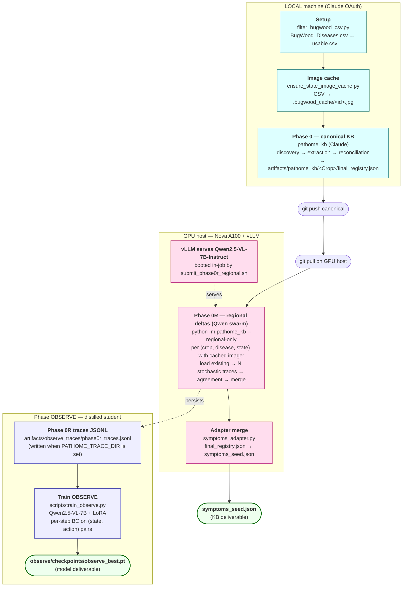
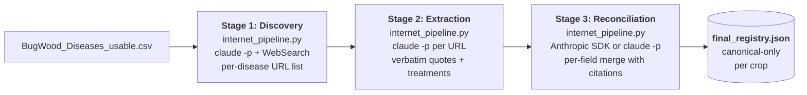
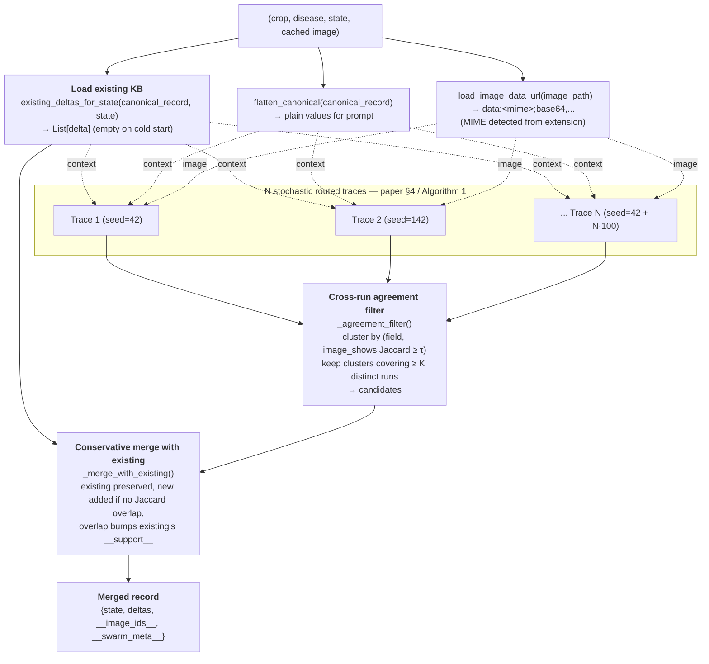
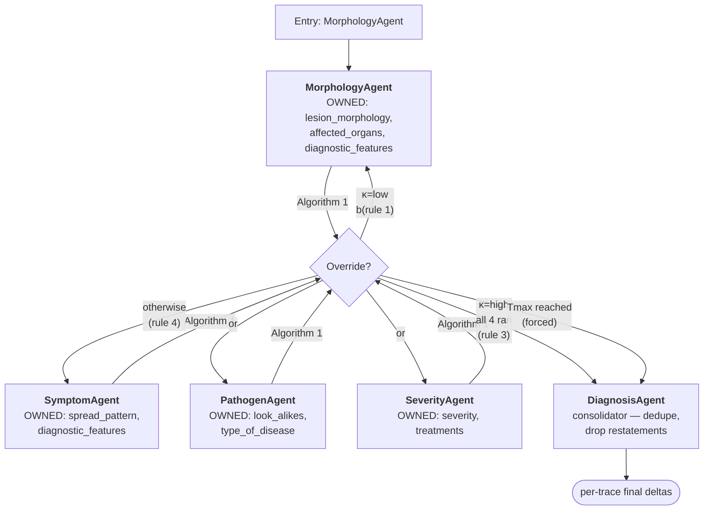
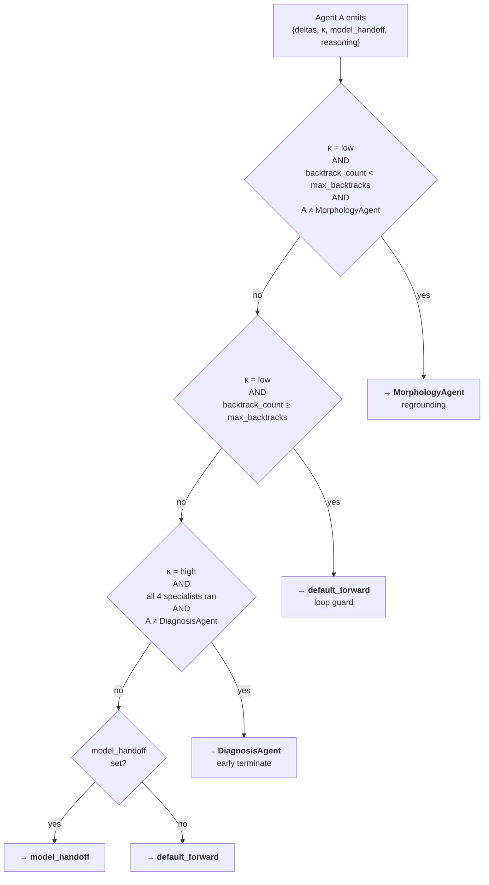

# PlantSwarm — End-to-End Flow Diagram

Current pipeline, top to bottom. The diagrams below render natively on
GitHub (Mermaid for flowcharts, ASCII for data-shape boxes). For the
narrative + commands, see [`README.md`](README.md). For the canonical-KB
internals, see [`pathome_kb/README.md`](pathome_kb/README.md).

---

## 1. Top-level pipeline (LOCAL → GitHub → GPU host)



| Stage | Host | Compute | Walltime |
|---|---|---|---|
| Setup | LOCAL or Nova | CPU, < 1 min | trivial |
| Image cache | LOCAL or Nova | network only | smoke ~2 min |
| Phase 0 (Claude) | LOCAL only (OAuth) | CPU + Anthropic API | smoke ~30 min / prod 16–24 h |
| Phase 0R (Qwen) | GPU host with vLLM | 1× A100-80GB | smoke ~20–40 min / prod 10–20 h |
| Adapter merge | Same as Phase 0R | CPU, seconds | trivial |
| Phase OBSERVE (train) | GPU host with CUDA | 1× A100 | ~4–8 h on Phase 0R traces |

---

## 2. Phase 0: canonical KB build (Claude)

Run by `python -m pathome_kb`. Three Claude-driven stages per crop, all
text-grounded (URL + verbatim quote per field). No images touched here.



Output shape (one disease entry):

```jsonc
{
  "disease_name": "Charcoal Rot",
  "pathogen_scientific_name": {
    "value": "Macrophomina phaseolina",
    "url":   "https://extension.umn.edu/.../charcoal-rot-soybean",
    "quote": "Charcoal rot is caused by the soilborne fungus..."
  },
  "type_of_disease":  { "value": "Fungal",  "url": "...", "quote": "..." },
  "affected_parts":   { "value": ["Foliar","Stem","Root","Pod"], ... },
  "visual_symptoms": {
    "summary":             { "value": "...", "url": "...", "quote": "..." },
    "diagnostic_features": { "value": "...", "url": "...", "quote": "..." },
    "look_alikes":         { "value": [], "url": "", "quote": "" }
  },
  "treatments":         { "value": [...], "url": "...", "quote": "..." },
  "regional_observations": {}        // <- filled by Phase 0R
}
```

---

## 3. Phase 0R: regional delta extraction (Qwen swarm)

Run by `python -m pathome_kb --regional-only` (or via the SLURM
submitter that boots vLLM in the same job). The top-level orchestrator
is `plantswarm.delta_pipeline.run_for_state`, called once per
(crop, disease, state, cached image) tuple.

### 3a. Per-tuple flow (the iterative KB loop)



After every (crop, disease, state) tuple finishes, `_embed_into_registry`
merges its per-state record back into the disease's
`regional_observations` dict — **states not processed this run are
preserved verbatim**.

### 3b. Inside one trace (Algorithm 1 routing)

Each of the N traces is a sequential traversal of the agent graph,
starting at `MorphologyAgent`. Each agent emits
`{deltas, confidence κ, handoff_target, reasoning}` and sees the canonical
slice + existing KB + prior trace context as input.



### 3c. Algorithm 1 — kappa-gated routing decision



| Per-agent `DEFAULT_FORWARD` | Per-agent `HANDOFF_MENU` |
|---|---|
| Morphology → SymptomAgent | {Symptom, Severity, Diagnosis} |
| Symptom → PathogenAgent | {Morphology, Pathogen, Severity, Diagnosis} |
| Pathogen → SeverityAgent | {Morphology, Symptom, Severity, Diagnosis} |
| Severity → DiagnosisAgent | {Morphology, Diagnosis} |

### 3d. Cross-run K-of-N agreement filter

After all N traces complete, the per-trace final-delta lists are pooled
and clustered:

```
Trace 0 final_deltas:  [δ₀₀, δ₀₁]
Trace 1 final_deltas:  [δ₁₀]
Trace 2 final_deltas:  [δ₂₀, δ₂₁, δ₂₂]
                ...
Trace N-1 final_deltas: [...]
                  │
                  ▼  group by field
       ┌──────────────────────────┐
       │ lesion_morphology:       │
       │   [(0, δ₀₀), (2, δ₂₀),   │
       │    (5, δ₅₀)]             │
       │ severity:                │
       │   [(0, δ₀₁), (1, δ₁₀)]   │
       │ ...                      │
       └────────────┬─────────────┘
                    ▼  greedy Jaccard cluster within each field
       ┌──────────────────────────────────────────┐
       │ lesion_morphology Cluster A:             │
       │   {(0, "pustular lesions w/ halos"),     │
       │    (2, "halos around pustules"),         │
       │    (5, "pustules surrounded by yellow")} │
       │   distinct_runs = {0, 2, 5}              │
       │   support = 3                            │ ← keep (≥ K)
       │                                          │
       │ severity Cluster B:                      │
       │   {(0, "carrot-shaped fronds")}          │
       │   distinct_runs = {0}                    │
       │   support = 1                            │ ← drop (< K)
       └──────────────────────────────────────────┘
                    │
                    ▼
       candidates (k-of-n survivors), each tagged
       with __support__ and __cluster_size__
```

### 3e. Conservative merge with existing KB

The candidates from agreement are merged into the **existing**
regional deltas for this state. Existing is never wiped.

```
existing  =  [E₀ (field=L, support=5),
              E₁ (field=S, support=3)]
candidates = [C₀ (field=L, new image_shows close to E₀: Jaccard ≥ τ),
              C₁ (field=P, new image_shows, no existing in field P),
              C₂ (field=S, new image_shows, contradicts E₁: Jaccard < τ)]
                                                                         │
                                                                         ▼
       ┌──────────────────────────────────────────┐
       │ For each candidate C:                    │
       │   if ∃ E with same field & Jaccard ≥ τ:  │
       │       E.support += C.support             │
       │       drop C                             │
       │   else:                                  │
       │       append C with C.support default 1  │
       └────────────┬─────────────────────────────┘
                    ▼
       merged  =  [E₀ (support=5+C₀.support=8),
                   E₁ (support=3),
                   C₁ (support=1),
                   C₂ (support=1)]
       counts  =  {n_existing=2, n_new_candidates=3,
                   n_added=2, n_overlaps_bumped=1}
```

Properties:
- **Idempotent on shape**: re-running with the same candidates against
  the same existing list doesn't add new entries; only bumps support.
- **Existing always preserved**: prior Phase 0R deltas are never
  overwritten.
- **Contradictions kept**: low-Jaccard same-field deltas are added as
  separate entries; downstream consumers see all observations and weigh.

---

## 3f. Phase OBSERVE — distilled student (LoRA fine-tune)

Trained on Phase 0R trace JSONL. At inference, replaces the
N-stochastic-traces swarm with a single forward pass.

```mermaid
flowchart TD
    P0R["Phase 0R run with PATHOME_TRACE_DIR=...<br/>(writes per-trace records to JSONL)"]
    JSONL[(<b>phase0r_traces.jsonl</b><br/>one line per (tuple, run):<br/>profile_id, path, decisions,<br/>context_buffer, final_deltas,<br/>existing_kb_at_start)]
    EXPAND["observe.trainer.load_phase0r_traces()<br/>expand to per-step TraceStepAnnotation"]
    SPLIT["split_annotations()<br/>group by image_path → train / val / held"]
    MODEL["OBSERVE = Qwen2.5-VL-7B + LoRA<br/>heads: routing(5), backtrack(1),<br/>ε(1), α(1), confidence(1), OC(1)"]
    TRAIN["OBSERVETrainer.train_epoch()<br/>multi-task loss: L_rt + 0.4·L_cal +<br/>0.2·L_cons + 0.3·L_OC"]
    CKPT[(<b>observe/checkpoints/observe_best.pt</b>)]
    INFER["observe.OBSERVEInference.predict(image, ctx)<br/>→ EpistemicAction(next_agent, backtrack,<br/>   κ, uncertainty, belief)"]

    P0R --> JSONL --> EXPAND --> SPLIT --> TRAIN
    MODEL --> TRAIN --> CKPT
    CKPT --> INFER
```

Per-step supervision derived from each trace's context_buffer:

| Target | Source |
|---|---|
| `target_routing` | `path[i+1]` — which agent the swarm called next |
| `target_backtrack` | 1 iff `path[i+1] == "MorphologyAgent" AND path[i] != "MorphologyAgent"` |
| `target_confidence` | κ ∈ {high, medium, low} → {0.9, 0.6, 0.3} |
| `target_epistemic` | `(n_final - n_at_step) / max(1, n_final)` — how much more came later |
| `target_aleatoric` | `1 - kappa_scalar` |
| `target_overconfidence` | 1 iff κ=high AND `len(deltas at step) == 0` |
| `target_belief` | `reasoning` string the agent emitted |

NOTE — Decision Transformer (`observe/decision_transformer.py`) and
GRPO (`observe/grpo.py`) are restored from the paper but **not yet
ported to delta-mode reward** (`delta_set_F1 + (1-ECE)` needs wiring).
The behavioral-cloning trainer is the v1 path.

---

## 4. Data shape evolution

What lives where, and what gets stripped vs preserved between layers.

```
                        artifacts/pathome_kb/<Crop>/final_registry.json
                        ┌──────────────────────────────────────────────┐
   Phase 0 writes ▶     │ {                                            │
                        │   "crop": "Soybean",                         │
                        │   "diseases": [{                             │
                        │     "disease_name": "Charcoal Rot",          │
                        │     "pathogen_scientific_name": { value, ... │
                        │     "visual_symptoms": { summary, ... },     │
                        │     "treatments": { value, url, quote },     │
   Phase 0R writes ▶    │     "regional_observations": {               │
                        │       "Alabama": {                           │
                        │          "state": "Alabama",                 │
                        │          "image_ids": [...],                 │
                        │          "deltas": [                         │
                        │            {field, canonical_says,           │
                        │             image_shows, image_quote,        │
                        │             image_id, __support__,           │
                        │             __cluster_size__}, ...           │
                        │          ],                                  │
                        │          "__swarm_meta__": {...}             │
                        │       },                                     │
                        │       "Connecticut": {...}                   │
                        │     }                                        │
                        │   }, ...]                                    │
                        │ }                                            │
                        └──────────────────────────────────────────────┘
                                              │
                                              ▼  symptoms_adapter.py
                                              │
                            artifacts/pathome_seed/symptoms_seed.json
                            ┌──────────────────────────────────────────┐
                            │ {                                        │
                            │   "min_observations": 3,                 │
                            │   "profiles": [{                         │
                            │     "profile_id": "Soybean::Charcoal Rot",│
                            │     "crop": "Soybean",                   │
                            │     "disease": "Charcoal Rot",           │
                            │     "canonical": {                       │
                            │       summary, diagnostic_features, ...  │
                            │       sources: {field: [{url, quote, ...│
                            │     },                                   │
                            │     "regional_observations": {           │
                            │       "Alabama": {                       │
                            │         state, image_ids,                │
                            │         deltas: [{                       │
                            │           field, canonical_says,         │
                            │           image_shows, image_quote,      │
                            │           image_id,                      │
                            │           support,   ← __support__       │
                            │           cluster_size,                  │
                            │         }],                              │
                            │         swarm_meta: {...}  ← __swarm_…  │
                            │       }                                  │
                            │     },                                   │
                            │     "state_counts": {...},               │
                            │     "aez_counts":   {...},               │
                            │     "reference_ids": [...]               │
                            │   }, ...]                                │
                            │ }                                        │
                            └──────────────────────────────────────────┘
                                              │
                                              ▼  pathome.SymptomLibrary.load()
                                              │
                                            consumers
```

The adapter strips the `__` prefix from telemetry keys but preserves all
the content — the seed JSON consumer sees `support`, `cluster_size`,
`swarm_meta` as clean keys.

When `PATHOME_TRACE_DIR` is set, Phase 0R also writes per-trace records
for OBSERVE training:

```
                $PATHOME_TRACE_DIR/phase0r_traces.jsonl     (append-mode)
                ┌──────────────────────────────────────────┐
                │ {                                        │   ← one line
                │   "ts": 1715520000.123,                  │     per (tuple, run)
                │   "profile_id": "Soybean::Charcoal Rot", │
                │   "crop": "...", "disease": "...",       │
                │   "state": "Alabama",                    │
                │   "primary_image_id": "bugwood::1568038",│
                │   "image_path": "...bugwood_cache/...",  │
                │   "run_idx": 0,                          │
                │   "path": ["MorphologyAgent",            │
                │            "SymptomAgent", ...,          │
                │            "DiagnosisAgent"],            │
                │   "decisions": ["model_choice", ...],    │
                │   "confidences": ["medium","high",...],  │
                │   "backtrack_count": 1,                  │
                │   "early_terminated": true,              │
                │   "context_buffer": [                    │
                │     { "agent_name": "MorphologyAgent",   │
                │       "deltas": [...],                   │
                │       "confidence": "medium",            │
                │       "handoff_target": "SymptomAgent",  │
                │       "reasoning": "...", "raw_text":"..."},│
                │     ... per agent step ...               │
                │   ],                                     │
                │   "final_deltas": [...],                 │
                │   "existing_kb_at_start": [...]          │
                │ }                                        │
                └──────────────────────────────────────────┘
```

This is the source the OBSERVE trainer reads.

---

## 5. File map

```
PlantSwarm/
├── README.md                              ← narrative + commands
├── FLOW.md                                ← (this file)
│
├── BugWood_Diseases.csv                   ← raw IPMNet export
├── BugWood_Diseases_usable.csv            ← filtered (Setup output)
│
├── configs/bugwood_pathome.yaml           ← swarm + model knobs
│
├── pathome_kb/                            Phase 0 + Phase 0R orchestration
│   ├── pipeline.py                        per-crop orchestrator (CLI)
│   ├── internet_pipeline.py               Claude discovery → extraction → reconciliation
│   ├── regional_observation.py            per-(crop, disease, state) Qwen-swarm caller
│   ├── symptoms_adapter.py                registry → SymptomProfile JSON
│   ├── prompts/                           canonical-stage prompts only
│   └── shared.py / utils.py / config.py
│
├── plantswarm/                            Qwen swarm
│   ├── delta_pipeline.py                  ← run_for_state, run_batch,
│   │                                        algorithm1_handoff, _merge_with_existing,
│   │                                        _agreement_filter, existing_deltas_for_state
│   └── latex/                             EMNLP 2026 paper sources
│
├── observe/                               Phase OBSERVE — distilled student
│   ├── model.py                           Qwen2.5-VL-7B + LoRA + 6 heads
│   ├── trainer.py                         RoutingTraceDataset (loads Phase 0R JSONL),
│   │                                        TraceStepAnnotation, OBSERVETrainer,
│   │                                        split_annotations (image-grouped)
│   ├── loss.py                            multi-task L = routing + cal + cons + OC + belief
│   ├── inference.py                       OBSERVEInference (single-pass replacement)
│   ├── decision_transformer.py            Phase A (not yet ported to delta-mode reward)
│   ├── grpo.py                            Phase B (not yet ported to delta-mode reward)
│   └── active_learning.py                 epsilon-aware sample selection
│
├── agents/                                5 delta-extraction agents
│   ├── base_agent.py                      DELTA_USER_PROMPT, parse_agent_output,
│   │                                        AgentDeltaOutput, _format_existing_kb,
│   │                                        _format_prior_context
│   ├── morphology_agent.py                lesion_morphology + affected_organs + diagnostic_features
│   ├── symptom_agent.py                   spread_pattern + diagnostic_features
│   ├── pathogen_agent.py                  look_alikes + type_of_disease
│   ├── severity_agent.py                  severity + treatments
│   └── diagnosis_agent.py                 per-trace consolidator
│
├── pathome/                               schema definitions for symptoms_seed.json
│   └── symptoms.py                        SymptomLibrary / SymptomProfile /
│                                          CanonicalDisease / RegionalObservation /
│                                          RegionalDelta / Citation
│
├── utils/
│   ├── vllm_client.py                     OpenAI-compatible vLLM client
│   │                                        (per-call seed + temperature override,
│   │                                         thread-safe guided-decoding fallback)
│   └── geo.py                             state centroid + AEZ lookup (Setup)
│
├── data/bugwood_loader.py                 _clean_disease + _map_crop (Setup helpers)
│
├── scripts/
│   ├── filter_bugwood_csv.py              Setup
│   ├── ensure_state_image_cache.py        per-(crop, disease, state) image cache
│   ├── registry_to_excel.py               final_registry.json → 1-sheet xlsx
│   ├── run_phase0_local.sh                LOCAL: canonical-only Phase 0
│   ├── submit_pathome_setup_filter.sh     Nova: filter CSV
│   ├── submit_phase0r_regional.sh         Nova: boot vLLM + run Phase 0R
│   ├── train_observe.py                   train OBSERVE on Phase 0R traces (CLI)
│   └── submit_observe_train.sh            Nova: train OBSERVE
│
└── smoke/                                 2-crop happy path (Soybean + Tomato)
    ├── run_phase0_full.sh                 LOCAL Phase 0 + (LOCAL-or-tunneled) Phase 0R
    ├── run_phase0_local.sh                LOCAL canonical-only Phase 0
    ├── bugwood_pathome_smoke.yaml         smaller N + Tmax
    └── README.md
```

---

## 6. Env var reference

| Env var | Default | What it controls |
|---|---|---|
| `VLLM_BASE_URL` | `http://localhost:8000/v1` | OpenAI-compatible vLLM endpoint |
| `VLLM_MODEL` | `Qwen/Qwen2.5-VL-7B-Instruct` | Served model id |
| `VLLM_TIMEOUT` | `180` | Per-HTTP-call timeout (seconds) |
| `VLLM_TEMPERATURE` | `0.8` | Per-call sampling temperature |
| `VLLM_N_RUNS` | `10` (smoke: `5`) | Stochastic traces per tuple (paper §5.3 used 30) |
| `VLLM_AGREEMENT_MIN` | `3` (smoke: `2`) | K-of-N — minimum runs that must agree |
| `VLLM_TMAX` | `15` (smoke: `8`) | Max path length per trace |
| `VLLM_MAX_BACKTRACKS` | `1` | Max times a trace can route back to MorphologyAgent |
| `VLLM_SIM_THRESHOLD` | `0.4` | Jaccard threshold for clustering AND merge dedup |
| `PATHOME_IMAGE_CACHE_DIR` | — (prepended to default search path) | Override cache directory |
| `PATHOME_TRACE_DIR` | — | When set, Phase 0R appends per-trace records to `<dir>/phase0r_traces.jsonl` for OBSERVE training |
| `PATHOME_TRACE_FILE` | `phase0r_traces.jsonl` | Trace JSONL filename within `PATHOME_TRACE_DIR` |
| `OBSERVE_EPOCHS` | `5` | Training epochs for `submit_observe_train.sh` |
| `OBSERVE_BATCH` | `4` | Training batch size |
| `OBSERVE_LR` | `1e-4` | AdamW learning rate |
| `OBSERVE_LORA_R` / `OBSERVE_LORA_ALPHA` | `16` / `32` | LoRA config |
| `OBSERVE_SAVE_DIR` | `observe/checkpoints/` | Checkpoint output |
| `ANTHROPIC_API_KEY` | — (optional) | Speeds up Phase 0 reconciliation; falls back to `claude -p` |
| `PATHOME_ONLY_CROPS` | — | Comma-separated crop allowlist |
| `PATHOME_USABLE_CSV` | `BugWood_Diseases_usable.csv` | Filtered CSV path |
| `PATHOME_SEED_FILE` | `artifacts/pathome_seed/symptoms_seed.json` | Output seed JSON path |
| `PATHOME_SEED_QUICK` | `0` | Cap states per disease for fast iteration |

---

## 7. Run-report line (one line per (crop, disease, state) tuple)

```
[7/50] ✓ Soybean::Charcoal Rot / Alabama  deltas=8 (N=10, K≥3, existing=4, added=2, bumped=3)
        │   │              │      │       │      │      │           │          │
        │   │              │      │       │      │      │           │          └─ candidates that overlapped
        │   │              │      │       │      │      │           │             existing → bumped support
        │   │              │      │       │      │      │           │             counter (no duplicate)
        │   │              │      │       │      │      │           └─ brand-new deltas added this run
        │   │              │      │       │      │      └─ existing deltas loaded from prior runs
        │   │              │      │       │      └─ K — agreement floor
        │   │              │      │       └─ N — stochastic traces
        │   │              │      └─ final merged delta count for this state
        │   │              └─ state
        │   └─ crop::disease
        └─ progress
```

Reading this:
- `existing=0, added=8` → cold start, swarm produced 8 new agreed deltas
- `existing=4, added=2, bumped=3` → iterative re-run; 4 prior preserved,
  2 net-new, 3 candidates already known (support incremented)
- `existing=4, added=0, bumped=0` → swarm produced no new info this run;
  KB stable for this state
