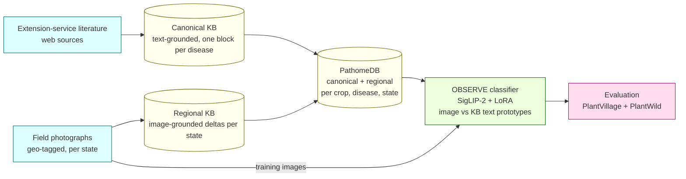
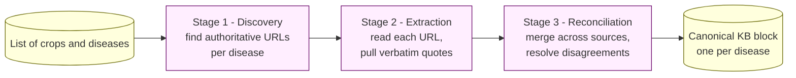
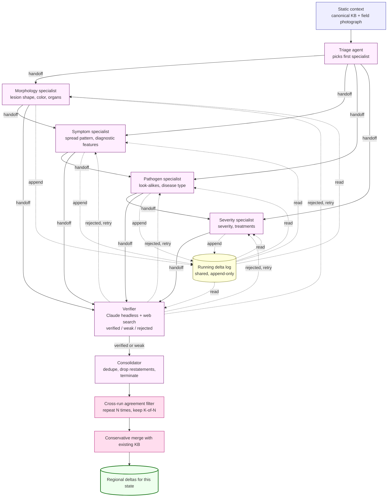
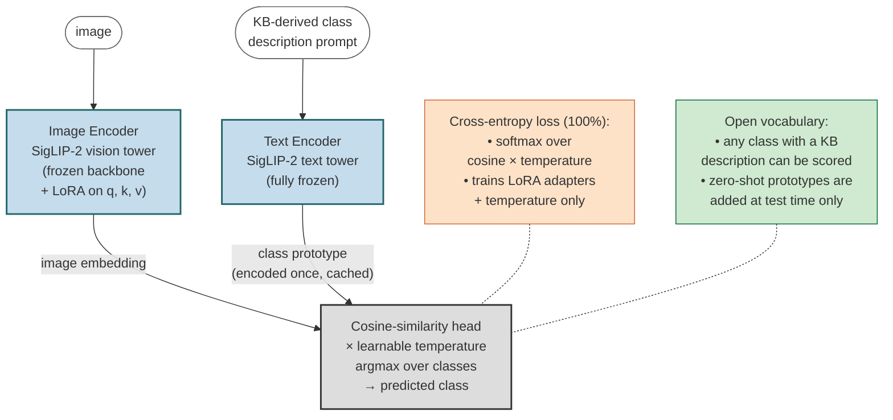
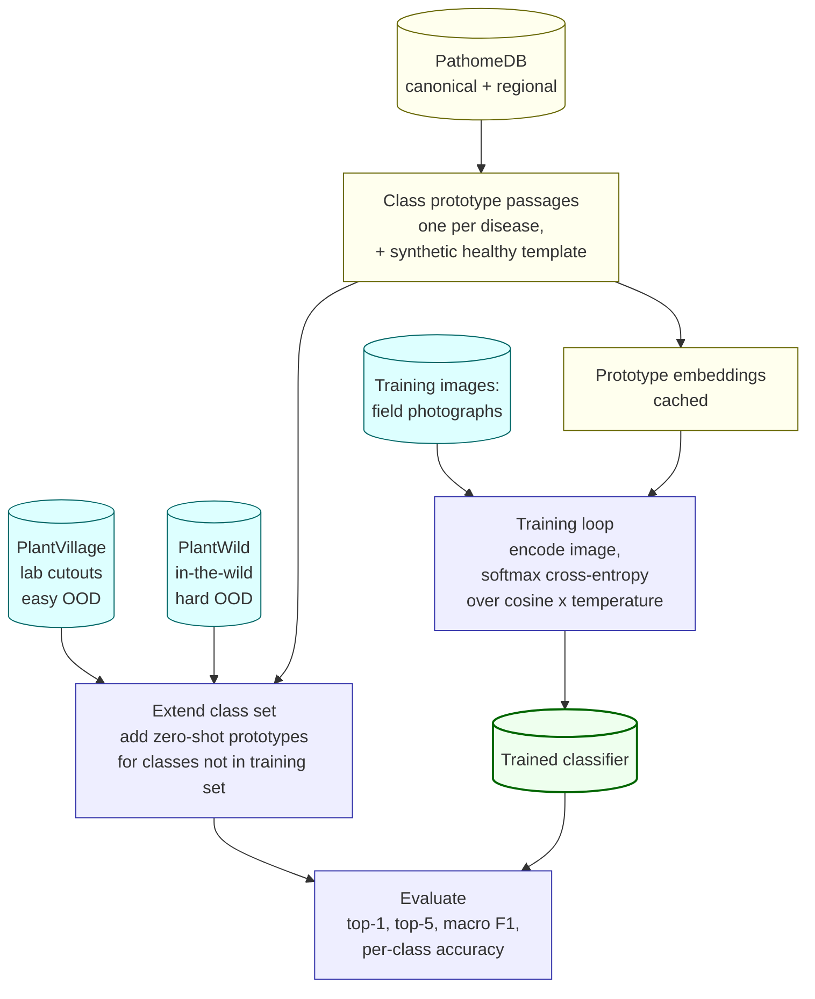
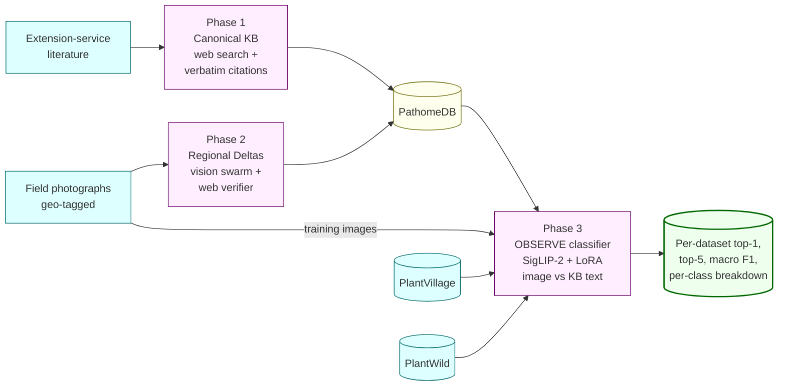

# PathomeDB and the Knowledge-Augmented OOD Classifier — Pipeline Overview

This document is a self-contained walkthrough of the three-stage
pipeline. It is written for a reader who wants to understand *what* is
built and *why*, without reading any source code.

The system has two interlocking deliverables:

1. **PathomeDB** — a plant disease knowledge base that combines
   text-grounded canonical descriptions (from extension-service
   literature) with image-grounded regional observations (from
   field photographs).
2. **OBSERVE** — a small, cheap image classifier whose class labels
   are *defined* by descriptions taken from PathomeDB. The classifier
   is trained on field photographs and evaluated on two
   out-of-distribution image domains.



The next three sections walk through each phase in turn. First, what
the pipeline actually sees on disk.

---

## Data sources and distributions

Three datasets feed the pipeline. **Bugwood** provides the training
images for the classifier; **PlantVillage** and **PlantWild** are the
two out-of-distribution evaluation sets. All numbers below are for
the Tomato slice — the current scope of the OBSERVE classifier.

### Bugwood (training set, in-the-wild)

Geo-tagged field photographs from the IPMNet image library, captured
by extension agents and researchers. After filtering to usable rows
with a resolved crop, disease, and state, the Tomato slice has
**605 images across 18 disease classes and 14 US states**. The matrix
below gives per-(state, class) counts for the top five classes; the
remaining 13 Tomato classes are grouped under "Others".

| State            | TSWV | Late Blight | Early Blight | Leaf Mould | Septoria | Others | **Total** |
|------------------|---:|---:|---:|---:|---:|---:|---:|
| North Carolina   |  90 |  50 |  17 |   0 |   0 | 115 |   **272** |
| Kentucky         |  14 |   0 |   8 |  15 |   9 |  37 |    **83** |
| Alabama          |   8 |  26 |   2 |   2 |   0 |  42 |    **80** |
| Maine            |   0 |  12 |  12 |  10 |  13 |  12 |    **59** |
| Virginia         |   2 |  23 |   0 |   5 |   1 |   9 |    **40** |
| Mississippi      |   0 |   0 |   4 |   6 |   0 |  20 |    **30** |
| Smaller (8 sts)  |   9 |   8 |   5 |   1 |   2 |  16 |    **41** |
| **Total**        | **123** | **119** | **48** | **39** | **25** | **251** | **605** |

The eight smaller states (New York, Louisiana, Delaware, South
Carolina, Connecticut, Georgia, Florida, Kansas) each contribute
fewer than 12 Tomato images. North Carolina alone supplies 45% of
the training images, and four classes — Tomato Spotted Wilt Virus
(TSWV), Late Blight, Early Blight, Leaf Mould — account for 71% of
the total. This concentration is the data-imbalance reality the
classifier has to handle; it's also why the Phase 2 regional deltas
are dominated by a few states (NC, KY, AL, ME, VA) and most other
states will end up with empty regional blocks for now.

### PlantVillage (evaluation set, lab cutouts — easy OOD)

The widely used PlantVillage benchmark — controlled studio
photographs of single leaves on uniform backgrounds. The full dataset
has **38 classes across 14 crops and 54,306 images**; the Tomato
slice has **10 classes and 18,160 images**. Per-class breakdown for
the Tomato slice (counts from the canonical PV release):

| PV class                            | Images | In PathomeDB | Prototype source |
|-------------------------------------|---:|:--:|:--|
| Tomato Bacterial Spot               | 2,127 | no  | zero-shot prompt |
| Tomato Early Blight                 | 1,000 | yes | KB block |
| Tomato Late Blight                  | 1,909 | yes | KB block |
| Tomato Leaf Mold                    |   952 | yes | KB block |
| Tomato Septoria Leaf Spot           | 1,771 | yes | KB block |
| Tomato Spider Mites (Two-spotted)   | 1,676 | no  | zero-shot prompt |
| Tomato Target Spot                  | 1,404 | no  | zero-shot prompt |
| Tomato Yellow Leaf Curl Virus       | 5,357 | no  | zero-shot prompt |
| Tomato Mosaic Virus                 |   373 | no  | zero-shot prompt |
| Tomato healthy                      | 1,591 | template | synthetic healthy prompt |
| **Total**                           | **18,160** | 4 KB + 1 template | |

The "In PathomeDB" column drives the KB-known vs zero-shot split in
the evaluation. Four of the ten Tomato classes have a full KB
profile from Phase 1+2 (so the classifier has both training images
*and* a rich KB prototype). Five classes fall back to a one-line
synthesised prompt at evaluation time (no KB block, no training
images — pure zero-shot through the SigLIP-2 text geometry). The
healthy class uses the synthetic healthy template.

### PlantWild (evaluation set, in-the-wild — hard OOD)

A separately collected in-the-wild benchmark released in 2024 with
**89 classes and ~18,500 images**. Tomato-relevant classes overlap
the PlantVillage disease vocabulary but the images themselves are
taken in real field conditions — cluttered backgrounds, variable
lighting, non-isolated leaves, smartphone capture. The Tomato slice
typically covers the same 8-10 disease classes as PlantVillage
(exact set depends on the release version). Per-class image counts
are read directly from the dataset root at evaluation time, since
the released folder layout is what the loader operates on.

### Why both PlantVillage and PlantWild

The two evaluation sets pose the same question — "does a classifier
trained on Bugwood field photographs generalize to a domain it has
never seen?" — but at different difficulties.

- **PlantVillage** shifts the *visual style* (field → lab cutout)
  while keeping the disease identity vocabulary mostly stable. It is
  the easier shift and tests style-invariance.
- **PlantWild** shifts the *collection itself* (Bugwood field photos
  → a different in-the-wild dataset). The visual style is closer to
  Bugwood but the photographer pool, camera distribution, and
  geographic coverage are different. It is the harder shift and
  tests collection-invariance.

The KB-known vs zero-shot per-class split is reported on both,
isolating how much of any accuracy gap is due to the model having a
KB prototype for the class versus going through the synthesised
fallback prompt.

---

## Phase 1 — Canonical Knowledge Base

**Goal.** For every (crop, disease) pair in scope, produce one
structured description of the disease that is grounded in
extension-service literature, with a URL and a verbatim quote
supporting every field.

This phase is text-only — no images are touched. The pipeline runs as
three sequential stages, each driven by a large language model with
web search:



The output, per disease, has the following structure (one example):

```jsonc
{
  "disease_name": "Charcoal Rot",
  "pathogen_scientific_name": {
    "value": "Macrophomina phaseolina",
    "url":   "https://extension.umn.edu/.../charcoal-rot-soybean",
    "quote": "Charcoal rot is caused by the soilborne fungus..."
  },
  "type_of_disease":  { "value": "Fungal",   "url": "...", "quote": "..." },
  "affected_parts":   { "value": ["Stem", "Root", "Pod"], "url": "...", "quote": "..." },
  "visual_symptoms": {
    "summary":             { "value": "...", "url": "...", "quote": "..." },
    "diagnostic_features": { "value": "...", "url": "...", "quote": "..." },
    "look_alikes":         { "value": "...", "url": "...", "quote": "..." }
  },
  "treatments": { "value": "...", "url": "...", "quote": "..." }
}
```

Every field carries the URL it came from and the verbatim quote that
supports it. This is the *text-grounded* half of PathomeDB. It is the
same regardless of geography — Charcoal Rot in Iowa has the same
canonical description as Charcoal Rot in Alabama.

---

## Phase 2 — Regional Image-Grounded Deltas (Handoff Swarm)

**Goal.** For every (crop, disease, state) tuple that has at least one
field photograph available, identify how the disease *presents in the
field in that state* and emit image-supported deltas that go beyond
what the canonical block already says — additions or contradictions,
never restatements.

### What changed from the previous design

The previous design ran four specialists in parallel against the
canonical block and the image. They never read each other's output.
A consolidator merged the four streams at the end, then an agreement
filter removed per-run hallucinations, then a web-search verifier
filtered the survivors. This was ensemble sampling with a cleanup
step, not a swarm.

The new design is a real handoff swarm. Specialists run sequentially.
Each one reads a shared running log of the deltas previous specialists
have already written. Each one decides which agent runs next. The
verifier is part of the loop, not a post-filter — it can hand a
rejected delta back to the originating specialist for refinement.

### Shared context

Every agent in the swarm reads two things.

A **static reference**. The canonical KB block for this disease, plus
the field photograph for this state. Neither changes during the run.

A **running log**. The deltas written so far in this run, in order,
each tagged with the agent that wrote it. Every agent appends to the
log when it finishes its turn. Every later agent reads it before
writing.

The running log is what makes the handoffs meaningful. Without it,
sequential specialists do the same thing as parallel specialists. With
it, each specialist builds on, refines, or contradicts what came
before.

### Diagram



### Agents

**Triage.** Reads the static context only. Decides which specialist
should run first based on what looks most off about the leaf. Hands
off to one of the four specialists. Writes nothing to the log.

**Morphology specialist.** Lesion shape, color, distribution on the
organ. Reads static context and running log. Writes morphology deltas.
Picks the next agent.

**Symptom specialist.** Spread pattern, systemic versus local,
diagnostic visual features. Reads static context and running log.
Writes symptom deltas. Picks the next agent.

**Pathogen specialist.** Look-alikes, confusion risks, disease-type
clues visible in the image. Reads static context and running log.
Writes look-alike deltas. Picks the next agent.

**Severity specialist.** Severity rating and treatment-relevant
observations. Reads static context and running log. Writes severity
deltas. Picks the next agent.

**Verifier.** Claude headless with web search. Reads the canonical
block, the image, and every delta written so far. For each unverified
delta, runs a web search and assigns one of three labels: *verified*,
*weakly supported*, or *rejected*. On verified or weakly supported,
marks the delta and hands off to the Consolidator. On rejected, hands
back to the specialist that wrote the delta with an explanation.

**Consolidator.** Reads everything. Deduplicates. Drops any delta that
merely restates the canonical block. Emits the final delta set and
terminates the run.

### Handoff rules

A specialist cannot hand off to itself.

A specialist may hand off to the Verifier mid-run if it wants its
deltas checked before later specialists depend on them.

The Verifier may hand back to any specialist for refinement, but a
single delta can be re-verified at most twice. On the third rejection
the Consolidator drops it.

The Consolidator is the only agent that can terminate. It terminates
when every delta has been labeled and no specialist has outstanding
work.

A maximum-turns cap (20 turns per run) prevents pathological loops.

### Stochastic re-runs

The whole sequential swarm is run N times with different random seeds.
Agent ordering, specialist routing, and per-agent generation are all
stochastic. The agreement filter keeps only deltas that appear in at
least K out of N independent runs. This removes per-run hallucinations
the same way the previous design did, but now over runs of the full
handoff sequence rather than over parallel single-shot calls.

### Conservative merge

Same as the previous design. New deltas are added to the existing
regional record without overwriting; overlapping deltas increase the
support count rather than replacing the entry.

### Output

The output format is unchanged.

```jsonc
{
  "disease_name": "Charcoal Rot",
  "canonical": { /* text-grounded block from Phase 1 */ },
  "regional_observations": {
    "Alabama": {
      "deltas": [
        {
          "field": "lesion_morphology",
          "canonical_says": "(not specified)",
          "image_shows": "yellow halos around dark sunken lesions",
          "image_evidence_id": "<photograph id>",
          "swarm_support": 4,
          "verification_status": "verified",
          "web_support": [
            { "url": "https://...", "quote": "..." }
          ],
          "handoff_provenance": [
            "morphology", "symptom", "pathogen", "verifier"
          ]
        }
      ]
    }
  }
}
```

The new `handoff_provenance` field records the chain of agents that
contributed to each delta. This is what enables the diagnostic metrics
below.

### Metrics that justify the design

Three diagnostic numbers prove the handoffs are doing real work.

1. **Reference rate.** For every delta written by a specialist that
   ran after position one, check whether the delta builds on a
   previous specialist's delta. A small LLM judge labels this. If the
   rate is near zero, specialists are ignoring the running log and the
   handoff design is decoration.

2. **Duplicate rate.** Number of deltas flagged as duplicates by the
   Consolidator, divided by total deltas, compared against the
   parallel-specialist baseline. Should drop sharply because later
   specialists can avoid restating what earlier ones already covered.

3. **Order sensitivity.** Run the swarm with three different starting
   orders on the same tuples. If verified deltas per tuple shift with
   order, the sequencing matters. If they do not, the handoffs are not
   doing useful work and the design should be parallelized.

Three bottom-line numbers go in the paper.

4. **Verified deltas per tuple.** Run the handoff swarm and the
   parallel-specialist design on the same N tuples. Count surviving
   deltas. Report mean, standard deviation, and a paired t-test.

5. **Verifier survival rate by agent position.** Plot the fraction of
   each agent's deltas that survive the verifier against the agent's
   position in the sequence. In a working handoff swarm, the curve
   rises across positions because later agents have more context. A
   flat curve means later agents are not using the running log.

6. **Verified deltas per dollar.** Total compute cost (tokens plus GPU
   seconds for Qwen plus Claude verifier tokens) divided by verified
   deltas. The number that defends against the "your method is just
   expensive" critique.

The honest failure cases are worth naming. If reference rate is near
zero, collapse to parallel. If duplicate rate does not drop, the
running log is not helping. If order does not matter, parallelize and
reclaim the speed. If verified deltas per dollar tie the parallel
design, report it honestly — the contribution is then the architecture,
not the numbers.

Together, the canonical block plus all per-state delta sets are what
we call **PathomeDB**. Each disease's entry separates *what is true
of this disease in general* (canonical) from *what is observed of
this disease here* (regional).

---

## Phase 3 — OBSERVE: KB-Augmented OOD Classifier

**Goal.** Build a small, cheap image classifier that holds up under
severe distribution shift. The classifier is trained on field
photographs of one image domain (Bugwood — extension-service field
photos), and evaluated on two completely different image domains
(PlantVillage — controlled studio cutouts; PlantWild — a different
in-the-wild dataset).

The key idea is to make classification *go through* the knowledge
base. Instead of learning a direct mapping from pixels to class
indices, the model learns to embed images into the same space as
text descriptions of diseases, and classifies by similarity. The text
descriptions come from PathomeDB.

### Architecture



**Figure.** OBSERVE keeps both SigLIP-2 encoders frozen and adds
small LoRA adapters on the query / key / value projections of the
vision tower's attention layers. The text tower is never touched.
Class prototypes — one rich text passage per disease, drawn from
PathomeDB — are encoded by the frozen text tower once and cached.
Each minibatch only runs the adapted vision tower; the prediction is
the argmax cosine similarity (scaled by a learnable temperature)
between the image embedding and the cached prototypes. Cross-entropy
on the cosine logits is the sole training objective; only the LoRA
adapters and the temperature receive gradients. Because the
classifier has no fixed-size class head, new classes can be added
at evaluation time simply by encoding their description prompt — this
is what enables open-vocabulary OOD evaluation on diseases the model
never saw images of during training.

The backbone is **SigLIP-2**, a vision-language model that was
pretrained on a very large corpus of image-caption pairs with a
sigmoid contrastive objective. It already knows how to align images
and text in a shared embedding space — we just need to nudge it
toward agricultural imagery and toward the kind of text PathomeDB
emits.

The training scheme is deliberately minimal:

| Component | What we do | Why |
|---|---|---|
| Vision tower (≈400M parameters) | Backbone frozen; **LoRA** adapters added to the query, key, and value projections of the attention layers (≈5M trainable parameters) | A small, low-rank adjustment is enough to specialize for plant disease imagery without forgetting the pretraining |
| Text tower | Frozen, no adaptation | The KB text is already well within the domain SigLIP-2 was pretrained on; touching the text side would risk damaging the alignment |
| Temperature | One learnable scalar (the cosine logit scale) | Lets the model calibrate how peaky its similarity distribution is |
| Class head | None | Classification is done by argmax cosine similarity against text prototypes; no fixed-size class layer means new classes can be added at test time without retraining |

### Class Prototypes

A *class prototype* is a single text passage that describes one
disease in enough detail that the text tower can produce a meaningful
embedding for it. We assemble each prototype from a fixed
template that pulls from PathomeDB:

```
A field photograph of {crop} affected by {disease}
({pathogen scientific name}, {type of disease}).
{canonical summary}.
Diagnostic features: {diagnostic features}.
May be confused with: {look-alikes}.
Affected parts: {affected plant parts}.
Regional variations: {top-K verified deltas across states}.
```

For "healthy" leaves (which the KB does not cover — extension
literature only describes diseases), we use a synthetic template:

```
A healthy {crop} leaf with no visible disease symptoms — uniform
green color, no lesions, no spots, no wilting, no chlorosis,
no necrosis.
```

Every class prototype is encoded **once** by the frozen text tower at
the start of training and cached. Training never re-encodes them.
This is what makes the classifier cheap to train: each minibatch only
runs the vision tower (plus the small LoRA adapters), then a single
matrix multiplication against the cached prototypes.

### Training and Evaluation Flow



What this loop optimizes per minibatch:

```
image_embedding   = vision_tower_with_LoRA(image)           # one vector
prototype_matrix  = (cached text embeddings)                # one row per class
similarity        = exp(temperature) * (image_embedding · prototype_matrix)
loss              = cross_entropy(similarity, true_class_index)
```

At evaluation time, two important behaviors emerge:

- **Open vocabulary.** The test class set is allowed to be *different*
  from the training class set. If PlantVillage includes a disease that
  the model never saw images of during training, we just add its KB
  prototype to the cache. If PlantVillage includes a disease that is
  not in PathomeDB at all, we fall back to a one-line synthetic prompt
  ("A field photograph of {crop} affected by {disease}."). Both kinds
  of new classes can be scored without retraining.
- **Distribution shift is the point.** The training domain
  (Bugwood — geo-tagged field photographs taken by extension workers
  and researchers) is visually very different from the test domains.
  PlantVillage is studio-quality cutouts on uniform backgrounds;
  PlantWild is a separately collected in-the-wild dataset. The
  hypothesis is that a classifier conditioned on KB text
  descriptions is invariant to visual-style shifts in a way that a
  pure-pixel classifier is not, because the disease *identity* is
  carried by the text geometry rather than the pixel statistics.

### What is reported

For each evaluation dataset (PlantVillage, PlantWild), we report:

- **Top-1 accuracy** — fraction of images whose top predicted class
  matches the true class.
- **Top-5 accuracy** — fraction of images whose true class is among
  the top five predictions.
- **Macro F1** — class-balanced F1 across the test classes.
- **Per-class accuracy**, with each class flagged as either
  *KB-known* (its prototype came from a full PathomeDB entry that
  the model saw at training time) or *zero-shot* (the prototype was
  added at evaluation time only).

The split between KB-known and zero-shot classes is what makes this
an honest test of open-vocabulary classification: any uplift the
model shows on zero-shot classes is uplift it gets from the KB text
geometry rather than from having seen images of that class.

---

## End-to-End Summary



In one sentence: Phase 1 builds a text-grounded knowledge base from
extension-service literature, Phase 2 grounds the KB in field
photographs by emitting per-state image-supported additions and
contradictions, and Phase 3 trains a small classifier that uses the
KB descriptions as its class labels and tests whether the resulting
classifier generalizes across two very different out-of-distribution
image domains.
