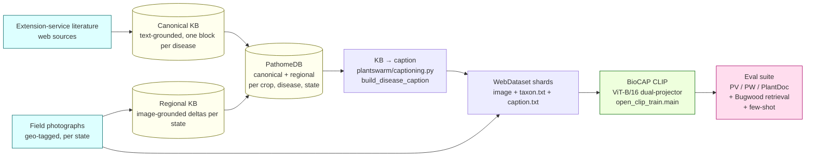
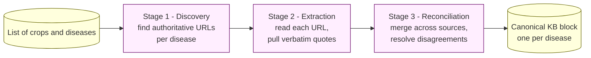
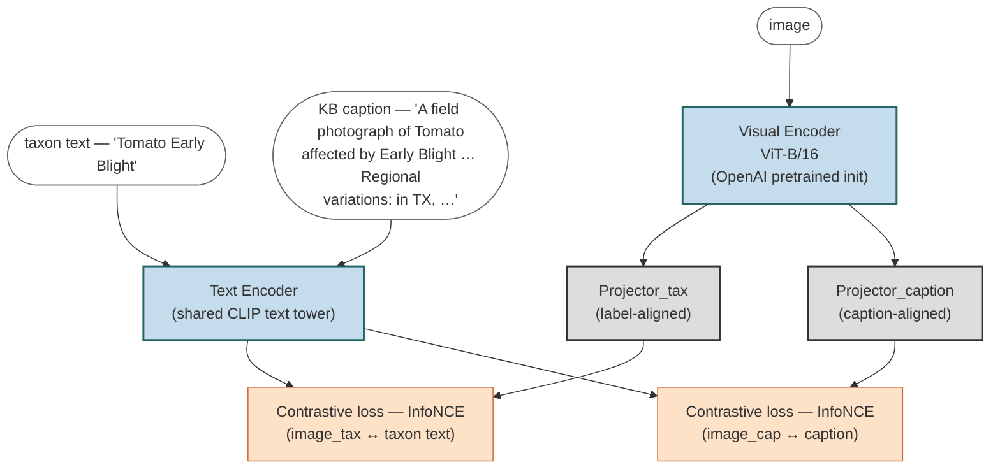
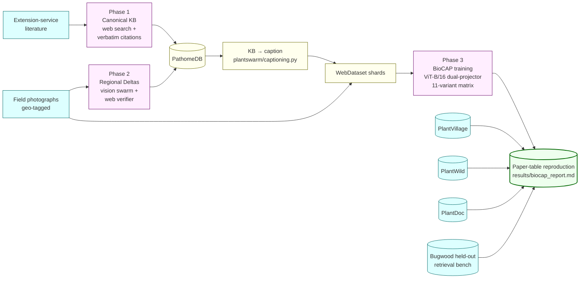

# PathomeDB and BioCAP-on-Bugwood — Pipeline Overview

This document is a self-contained walkthrough of the three-stage
pipeline. It is written for a reader who wants to understand *what* is
built and *why*, without reading any source code.

The system has two interlocking deliverables:

1. **PathomeDB** — a plant disease knowledge base that combines
   text-grounded canonical descriptions (from extension-service
   literature) with image-grounded regional observations (from
   field photographs).
2. **BioCAP-on-Bugwood** — a faithful adaptation of
   [BioCAP (Zhang et al., 2025)](https://arxiv.org/abs/2510.20095)
   to crop disease. BioCAP is an OpenCLIP fork with **two visual
   projectors** — one aligned to the short label text, one to a long
   descriptive caption. PathomeDB renders the long caption per image
   (canonical KB text + the image's state-specific regional deltas);
   Bugwood provides the images. Eleven training variants (T01–T11)
   reproduce every reproducible BioCAP paper table — see [paper-table
   map](#paper-table-map) below.



The next three sections walk through each phase in turn. First, what
the pipeline actually sees on disk.

---

## Data sources and distributions

Three datasets feed the pipeline. **Bugwood** provides the training
images for the classifier; **PlantVillage** and **PlantWild** are the
two out-of-distribution evaluation sets. The numbers below describe
each dataset at full scope.

### Bugwood (training set, in-the-wild)

Geo-tagged field photographs from the IPMNet image library, captured
by extension agents and researchers. After filtering to usable rows
with a resolved crop, disease, and state, the full dataset has
**11,513 images across 484 (crop, disease) classes, 197 crops, and 47
US states**.

Per-state distribution (top 20 states by image count):

| State            | Images | State            | Images |
|------------------|---:|------------------|---:|
| North Carolina   | 3,771 | New York         |   204 |
| Maine            | 2,047 | Oregon           |   177 |
| Kentucky         |   786 | Iowa             |   175 |
| California       |   756 | Arizona          |   170 |
| Alabama          |   444 | Indiana          |   161 |
| Virginia         |   302 | Louisiana        |   144 |
| Colorado         |   279 | Mississippi      |   142 |
| Florida          |   279 | Georgia          |   136 |
| Wisconsin        |   127 | Montana          |   109 |
| Idaho            |   104 | South Carolina   |   104 |

Per-crop distribution (top 15 crops by image count, out of 197 total):

| Crop          | Images | Crop          | Images |
|---------------|---:|---------------|---:|
| Cucumber      |   672 | Wheat         |   382 |
| Sweet Potato  |   618 | Melon         |   362 |
| Tomato        |   605 | Corn          |   265 |
| Watermelon    |   594 | Potato        |   252 |
| Squash        |   529 | Pepper        |   242 |
| Soybean       |   397 | Hops          |   222 |
| Lettuce       |   386 | Oak           |   185 |
| Strawberry    |   177 |               |       |

Per-class size distribution (484 (crop, disease) classes total):

| Class size  | # of classes |
|-------------|---:|
| 10–19 images   | 320 |
| 20–49 images   | 126 |
| 50–99 images   |  28 |
| 100–199 images |   8 |
| ≥200 images    |   2 |

The dataset is **heavy-tailed**: 66% of classes have fewer than 20
images, the median class size is in the teens, and the top two states
(North Carolina + Maine) supply 50% of all photographs. This
imbalance is the central data reality the classifier has to handle.

### PlantVillage (evaluation set, lab cutouts — easy OOD)

The widely used PlantVillage benchmark — controlled studio
photographs of single leaves on uniform backgrounds. The full dataset
has **38 classes across 14 crops and 54,306 images** in the canonical
release. Per-crop class breakdown:

| Crop        | Classes |     | Crop        | Classes |
|-------------|---:|---|-------------|---:|
| Tomato      | 10 |   | Cherry      |  2 |
| Apple       |  4 |   | Peach       |  2 |
| Corn        |  4 |   | Bell Pepper |  2 |
| Grape       |  4 |   | Strawberry  |  2 |
| Potato      |  3 |   | Blueberry   |  1 |
|             |    |   | Orange      |  1 |
|             |    |   | Raspberry   |  1 |
|             |    |   | Soybean     |  1 |
|             |    |   | Squash      |  1 |

Each PV class is one of three *kinds*: a disease (most classes), a
healthy reference (14 classes — one per crop except where the crop
only has a healthy version), or a pest (1 class — Tomato Spider
Mites). Per-class image counts range from a few hundred (e.g.
Tomato Mosaic Virus ≈ 373) to several thousand (e.g. Tomato Yellow
Leaf Curl Virus ≈ 5,357) in the canonical release; the dataset is
heavily biased toward common diseases of staple crops.

At evaluation time each PV class is mapped to either a **KB
prototype** (the class has a full PathomeDB entry from Phase 1+2),
a **synthetic healthy template** (for the 14 healthy classes, since
extension literature only describes diseases), or a **one-line
zero-shot prompt** (for classes with no KB entry). The KB-known vs
zero-shot split is reported per class in the evaluation output.

### PlantWild (evaluation set, in-the-wild — hard OOD)

A separately collected in-the-wild benchmark with **89 classes**
split into **56 diseased + 33 healthy** classes (PlantWild paper,
Figure 3). Per-class image counts are highly imbalanced: the largest
class has **589 images**, the smallest has **44**, and most classes
fall between 100 and 300. The dataset is heavy-tailed; the long tail
of small classes is where in-the-wild OOD generalization is hardest.

Images are taken in real field conditions — cluttered backgrounds,
variable lighting, non-isolated leaves, smartphone capture — making
this the harder of the two evaluation sets. The class vocabulary
overlaps PlantVillage but is broader (89 vs 38 classes); many of
PlantWild's classes are not in PathomeDB at all, so the proportion
of zero-shot prompts is higher on PW than on PV. The same KB vs
zero-shot mapping applies — classes with a KB entry get the rich
KB-derived prototype, classes without one fall back to a one-line
synthesized prompt assembled from the (crop, disease) folder name.

### Why both PlantVillage and PlantWild

The two evaluation sets pose the same question — "does a classifier
trained on Bugwood field photographs generalize to a domain it has
never seen?" — but at different difficulties.

- **PlantVillage** shifts the *visual style* (field → lab cutout)
  while keeping the disease identity vocabulary mostly stable. It is
  the easier shift and tests style-invariance.
- **PlantWild** shifts the *collection itself* (Bugwood field photos
  → a different in-the-wild dataset). The visual style is closer to
  Bugwood but the photographer pool, camera distribution, geographic
  coverage, and class vocabulary are different. It is the harder
  shift and tests collection-invariance.

The KB-known vs zero-shot per-class split is reported on both,
isolating how much of any accuracy gap is due to the model having a
KB prototype for the class versus going through the synthesized
fallback prompt.

---

## Phase 1 — Canonical Knowledge Base

**Goal.** For every (crop, disease) pair in scope, produce one
structured description of the disease that is grounded in
extension-service literature, with a URL and a verbatim quote
supporting every field.

This phase is text-only — no images are touched. The pipeline runs as
three sequential stages, each driven by a large language model with
web search:



The output, per disease, has the following structure (one example):

```jsonc
{
  "disease_name": "Charcoal Rot",
  "pathogen_scientific_name": {
    "value": "Macrophomina phaseolina",
    "url":   "https://extension.umn.edu/.../charcoal-rot-soybean",
    "quote": "Charcoal rot is caused by the soilborne fungus..."
  },
  "type_of_disease":  { "value": "Fungal",   "url": "...", "quote": "..." },
  "affected_parts":   { "value": ["Stem", "Root", "Pod"], "url": "...", "quote": "..." },
  "visual_symptoms": {
    "summary":             { "value": "...", "url": "...", "quote": "..." },
    "diagnostic_features": { "value": "...", "url": "...", "quote": "..." },
    "look_alikes":         { "value": "...", "url": "...", "quote": "..." }
  },
  "treatments": { "value": "...", "url": "...", "quote": "..." }
}
```

Every field carries the URL it came from and the verbatim quote that
supports it. This is the *text-grounded* half of PathomeDB. It is the
same regardless of geography — Charcoal Rot in Iowa has the same
canonical description as Charcoal Rot in Alabama.

---

## Phase 2 — Regional Image-Grounded Deltas (Handoff Swarm)

**Goal.** For every (crop, disease, state) tuple that has at least one
field photograph available, identify how the disease *presents in the
field in that state* and emit image-supported deltas that go beyond
what the canonical block already says — additions or contradictions,
never restatements.

### What changed from the previous design

The previous design ran four specialists in parallel against the
canonical block and the image. They never read each other's output.
A consolidator merged the four streams at the end, then an agreement
filter removed per-run hallucinations, then a web-search verifier
filtered the survivors. This was ensemble sampling with a cleanup
step, not a swarm.

The new design is a real handoff swarm. Specialists run sequentially.
Each one reads a shared running log of the deltas previous specialists
have already written. Each one decides which agent runs next. The
verifier is part of the loop, not a post-filter — it can hand a
rejected delta back to the originating specialist for refinement.

### Shared context

Every agent in the swarm reads two things.

A **static reference**. The canonical KB block for this disease, plus
the field photograph for this state. Neither changes during the run.

A **running log**. The deltas written so far in this run, in order,
each tagged with the agent that wrote it. Every agent appends to the
log when it finishes its turn. Every later agent reads it before
writing.

The running log is what makes the handoffs meaningful. Without it,
sequential specialists do the same thing as parallel specialists. With
it, each specialist builds on, refines, or contradicts what came
before.

### Diagram


*A four-act walkthrough of one Phase 2 tuple. **Act I** introduces
the static context (a canonical KB block and a field photograph) and
the agent line-up, with each specialist's owned-fields shown.
**Act II** runs a single pass: Triage picks the first specialist;
each specialist reads the running delta log on the right, writes its
own delta, and hands off to the next agent; the Verifier consults
the open web for every delta, rejects one as under-specified (it
turns red), hands it back to the originating specialist for
refinement (it returns in green); the Consolidator deduplicates and
emits the final delta set. **Act III** zooms out: the whole swarm
runs N=5 times with different seeds; the K-of-N agreement filter
keeps only deltas that appear in at least K independent runs. **Act
IV** shows the conservative merge with the existing KB record and
the final JSON shape — each delta carries its support count,
verification status, web citations, and the handoff chain that
produced it.*

### Agents

**Triage.** Reads the static context only. Decides which specialist
should run first based on what looks most off about the leaf. Hands
off to one of the four specialists. Writes nothing to the log.

**Morphology specialist.** Lesion shape, color, distribution on the
organ. Reads static context and running log. Writes morphology deltas.
Picks the next agent.

**Symptom specialist.** Spread pattern, systemic versus local,
diagnostic visual features. Reads static context and running log.
Writes symptom deltas. Picks the next agent.

**Pathogen specialist.** Look-alikes, confusion risks, disease-type
clues visible in the image. Reads static context and running log.
Writes look-alike deltas. Picks the next agent.

**Severity specialist.** Severity rating and treatment-relevant
observations. Reads static context and running log. Writes severity
deltas. Picks the next agent.

**Verifier.** Claude headless with web search. Reads the canonical
block, the image, and every delta written so far. For each unverified
delta, runs a web search and assigns one of three labels: *verified*,
*weakly supported*, or *rejected*. On verified or weakly supported,
marks the delta and hands off to the Consolidator. On rejected, hands
back to the specialist that wrote the delta with an explanation.

**Consolidator.** Reads everything. Deduplicates. Drops any delta that
merely restates the canonical block. Emits the final delta set and
terminates the run.

### Handoff rules

A specialist cannot hand off to itself.

A specialist may hand off to the Verifier mid-run if it wants its
deltas checked before later specialists depend on them.

The Verifier may hand back to any specialist for refinement, but a
single delta can be re-verified at most twice. On the third rejection
the Consolidator drops it.

The Consolidator is the only agent that can terminate. It terminates
when every delta has been labeled and no specialist has outstanding
work.

A maximum-turns cap (20 turns per run) prevents pathological loops.

### Stochastic re-runs

The whole sequential swarm is run N times with different random seeds.
Agent ordering, specialist routing, and per-agent generation are all
stochastic. The agreement filter keeps only deltas that appear in at
least K out of N independent runs. This removes per-run hallucinations
the same way the previous design did, but now over runs of the full
handoff sequence rather than over parallel single-shot calls.

### Conservative merge

Same as the previous design. New deltas are added to the existing
regional record without overwriting; overlapping deltas increase the
support count rather than replacing the entry.

### Output

The output format is unchanged.

```jsonc
{
  "disease_name": "Charcoal Rot",
  "canonical": { /* text-grounded block from Phase 1 */ },
  "regional_observations": {
    "Alabama": {
      "deltas": [
        {
          "field": "lesion_morphology",
          "canonical_says": "(not specified)",
          "image_shows": "yellow halos around dark sunken lesions",
          "image_evidence_id": "<photograph id>",
          "swarm_support": 4,
          "verification_status": "verified",
          "web_support": [
            { "url": "https://...", "quote": "..." }
          ],
          "handoff_provenance": [
            "morphology", "symptom", "pathogen", "verifier"
          ]
        }
      ]
    }
  }
}
```

The new `handoff_provenance` field records the chain of agents that
contributed to each delta. This is what enables the diagnostic metrics
below.

### Metrics that justify the design

Three diagnostic numbers prove the handoffs are doing real work.

1. **Reference rate.** For every delta written by a specialist that
   ran after position one, check whether the delta builds on a
   previous specialist's delta. A small LLM judge labels this. If the
   rate is near zero, specialists are ignoring the running log and the
   handoff design is decoration.

2. **Duplicate rate.** Number of deltas flagged as duplicates by the
   Consolidator, divided by total deltas, compared against the
   parallel-specialist baseline. Should drop sharply because later
   specialists can avoid restating what earlier ones already covered.

3. **Order sensitivity.** Run the swarm with three different starting
   orders on the same tuples. If verified deltas per tuple shift with
   order, the sequencing matters. If they do not, the handoffs are not
   doing useful work and the design should be parallelized.

Three bottom-line numbers go in the paper.

4. **Verified deltas per tuple.** Run the handoff swarm and the
   parallel-specialist design on the same N tuples. Count surviving
   deltas. Report mean, standard deviation, and a paired t-test.

5. **Verifier survival rate by agent position.** Plot the fraction of
   each agent's deltas that survive the verifier against the agent's
   position in the sequence. In a working handoff swarm, the curve
   rises across positions because later agents have more context. A
   flat curve means later agents are not using the running log.

6. **Verified deltas per dollar.** Total compute cost (tokens plus GPU
   seconds for Qwen plus Claude verifier tokens) divided by verified
   deltas. The number that defends against the "your method is just
   expensive" critique.

The honest failure cases are worth naming. If reference rate is near
zero, collapse to parallel. If duplicate rate does not drop, the
running log is not helping. If order does not matter, parallelize and
reclaim the speed. If verified deltas per dollar tie the parallel
design, report it honestly — the contribution is then the architecture,
not the numbers.

Together, the canonical block plus all per-state delta sets are what
we call **PathomeDB**. Each disease's entry separates *what is true
of this disease in general* (canonical) from *what is observed of
this disease here* (regional).

---

## Phase 3 — BioCAP: KB-grounded Two-Projector CLIP

**Goal.** Train a CLIP-style foundation model from BioCAP
([Zhang et al., 2025](https://arxiv.org/abs/2510.20095)) on Bugwood
images, with descriptive captions synthesised from PathomeDB. Then
evaluate it on PlantVillage / PlantWild / PlantDoc plus a Bugwood
held-out retrieval bench, reproducing every reproducible BioCAP paper
table.

The key idea, faithful to the BioCAP paper, is that images and
captions are two noisy projections of the same latent species/disease
trait vector. Contrastive training over both views encourages the
image embedding to align with *diagnostic* characters and suppress
visual nuisance (pose, lighting, background). BioCAP's architectural
contribution is **two separate visual projectors** on top of the
shared visual encoder: one is contrastively aligned to short
taxonomic labels, the other to long descriptive captions. Heterogeneous
supervision (labels are precise but trait-thin; captions are noisy but
trait-rich) is routed through separate heads to avoid interference.

### Architecture



**Figure.** ViT-B/16 from OpenAI's pretrained CLIP is the visual
backbone. On top, two linear projectors emit two image embeddings.
The shared text tower encodes both the short label and the long
caption. Each batch draws a random text type per sample (`--text-type
random`) and routes that sample's loss through the matching
projector. The base BioCAP recipe trains for 50 epochs with AdamW,
warmup 500, lr 1e-4, weight decay 0.2 (Tables 9 and 10 in the paper).
Bugwood is much smaller than TreeOfLife-10M, so our wrapper drops the
per-GPU batch size to 256 and removes multi-node rendezvous (one GPU
is enough).

The 11-variant training matrix below covers every reproducible
ablation in the paper. The matrix lives in
`scripts/biocap_variants.sh` and is mirrored in
`scripts/train_biocap.py::VARIANTS`.

| Variant | Strategy | Projector | Epochs | Subset | Paper tables |
|---|---|---|---|---|---|
| T01 | label_only | dual | 50 | all | Table 3 row "None" |
| T02 | summary_only | dual | 50 | all | Table 3 |
| T03 | canonical_full | dual | 50 | all | Table 3 |
| **T04** | **canonical_deltas_3** | **dual** | **50** | **all** | **Tables 1, 3, 17, 18, 19, 20 (MAIN METHOD)** |
| T05 | canonical_deltas_1 | dual | 50 | all | Table 6 |
| T06 | canonical_deltas_5 | dual | 50 | all | Table 6 |
| T07 | canonical_deltas_7 | dual | 50 | all | Table 6 |
| T08 | canonical_deltas_3 | single | 50 | all | Figure 3 |
| T09 | canonical_deltas_3 | dual | 100 | all | Figure 3 |
| T10 | canonical_deltas_3 | dual | 50 | covered | Table 4 |
| T11 | canonical_deltas_3 | dual | 50 | non_covered | Table 4 |

### Caption synthesis

A *caption* in BioCAP-on-Bugwood is a long descriptive passage
emitted by `plantswarm/captioning.py::build_disease_caption`:

```
A field photograph of {crop} affected by {disease}
({pathogen scientific name}, {type of disease}).
{canonical summary}.
Diagnostic features: {diagnostic features}.
May be confused with: {look-alikes}.
Affected parts: {affected plant parts}.
Regional variations: {top-K verified deltas for THIS image's state}.
```

The state-aware delta selection is the key adaptation of BioCAP to
crop disease: each image's caption is biased toward the *state
where this image was taken*, falling back to top-K cross-state deltas
when the image's state has none. This makes the caption *image-grouping
specific* (per (disease, state)) without needing a per-image MLLM —
the user explicitly chose this KB-only path over running InternVL3 on
Bugwood.

For "healthy" rows (Bugwood is disease-only, so this only applies if a
healthy class is added to eval), the synthetic template `"A healthy
{crop} leaf with no visible disease symptoms — uniform green color,
no lesions, no spots, no wilting, no chlorosis, no necrosis."` is used.

The seven caption strategies in `STRATEGIES` correspond to the rows of
paper Table 3 (caption ablation) and Table 6 (#-of-deltas ablation).

### Paper-table map

`scripts/aggregate_biocap_tables.py` walks the per-variant eval JSONs
and produces these markdown tables. Each cell reads from
`results/biocap_eval/<run_id>/{plantvillage,plantwild,plantdoc,retrieval,fewshot_*}.json`.

| Paper table | Reproduced by | Variants needed |
|---|---|---|
| Table 1 — Zero-shot classification | `evaluate_biocap.py` on PV+PW | T04 + 7 baselines |
| Table 2 — Natural-language retrieval | `evaluate_biocap_retrieval.py` on Bugwood holdout | T04 + 7 baselines |
| Table 3 — Caption-strategy ablation | `evaluate_biocap.py` over T01–T04 | T01, T02, T03, T04, T05, T06, T07 |
| Table 4 — Covered vs non-covered split | `evaluate_biocap.py` over T10/T11 | T04, T10, T11 |
| Table 6 — Number-of-deltas ablation | `evaluate_biocap.py` over delta count | T04, T05, T06, T07 |
| Table 8 — KB coverage (descriptive) | reads `artifacts/pathome_kb/*/final_registry.json` | — |
| Table 13 — Eval dataset stats (descriptive) | walks `data/eval/{PlantVillage,PlantWild,PlantDoc}/` | — |
| Table 17 — Underrepresented species groups | re-slice of `evaluate_biocap.py` results | T04 + 7 baselines |
| Table 18 — Few-shot top-1 | `evaluate_biocap_fewshot.py`, k∈{1,5} | T04 + 7 baselines |
| Table 19 — Beyond classification (PlantDoc) | `evaluate_biocap.py --plantdoc-root` | T04 + 7 baselines |
| Table 20 — Caption × few-shot | combine Table 3 variants with few-shot eval | T01..T07 |
| Figure 3 — Recipe ablation | T04 vs T08 vs T09 | T04, T08, T09 |

**Skipped paper tables and why**:

| Table | Reason |
|---|---|
| 5, 21 | Human-evaluator win-rate / inter-rater agreement — needs human raters |
| 7 | MLLM-captioner family/size ablation — user chose KB-only path (no MLLM) |
| 11 | GPT-4o / Gemini agreement for *bird behaviors* — not applicable to crop disease |
| 12 | Retrieval bench stats — equivalent info already in Table 2 |
| 14 | CUB localization (energy-pointing game) — Bugwood has no bounding boxes |
| 15 | Class-level vs order-level format-examples — N/A for KB path |
| 16 | Stability across regenerated format-example sets — N/A for KB path |

### Evaluation surfaces

For each (model, eval-dataset) cell, three evaluators run:

1. **`evaluate_biocap.py`** — zero-shot classification. Walks PV/PW/PlantDoc
   folder structures into a BioCAP-format CSV (idx, filepath, class)
   and calls `evaluation.zero_shot_iid.zero_shot_eval` programmatically.
   Reports top-1, top-3 (when ≥3 classes), top-5 (when ≥5).
2. **`evaluate_biocap_retrieval.py`** — Bugwood held-out R@k. Reads
   the `split=holdout` rows from a captions parquet, encodes images +
   captions with the chosen model, computes I2T and T2I R@{1,5,10}.
3. **`evaluate_biocap_fewshot.py`** — prototype-mean K-shot protocol
   on PV/PW/PlantDoc. For each of 5 seeds, samples K shots per class,
   computes class-mean features, predicts argmax cosine over the rest,
   reports mean ± std over seeds for K∈{1, 5}.

All three accept either an HF hub path (`hf-hub:imageomics/biocap`)
or a local checkpoint, so the same scripts evaluate trained variants
and off-shelf baselines.

---

## End-to-End Summary



In one sentence: Phase 1 builds a text-grounded knowledge base from
extension-service literature, Phase 2 grounds the KB in field
photographs by emitting per-state image-supported additions and
contradictions, and Phase 3 — BioCAP-on-Bugwood — synthesises a
per-image caption from the KB, packages images + captions as
WebDataset shards, trains 11 ViT-B/16 dual-projector variants covering
every reproducible ablation in the BioCAP paper, and emits a master
`results/biocap_report.md` with the reproduced paper tables.
