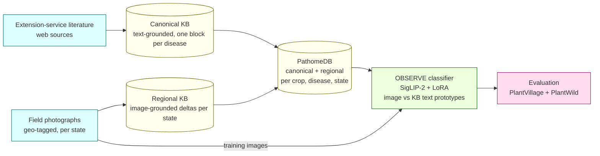
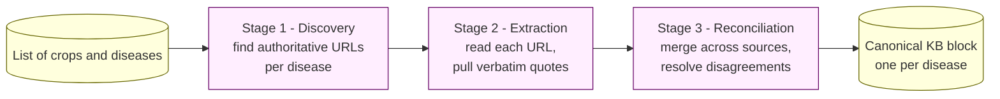
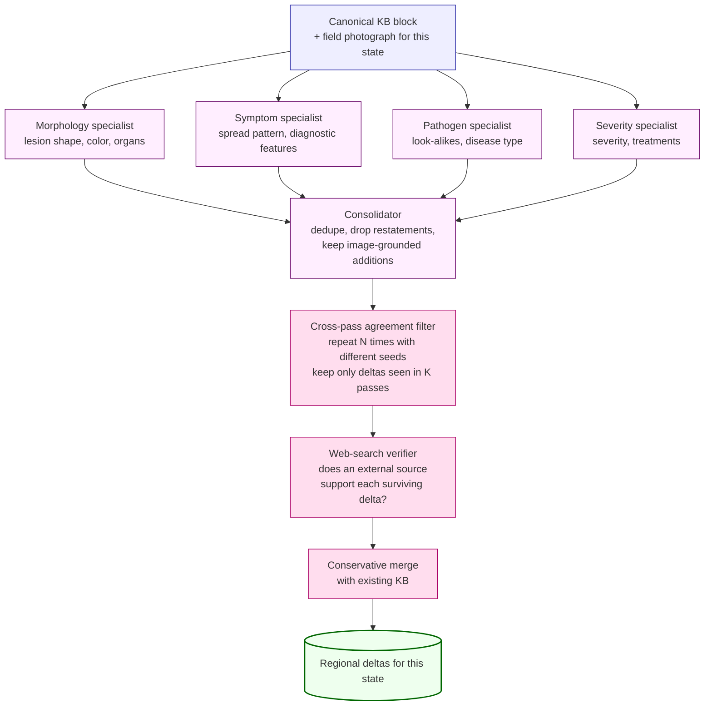
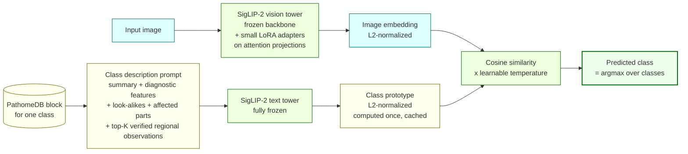
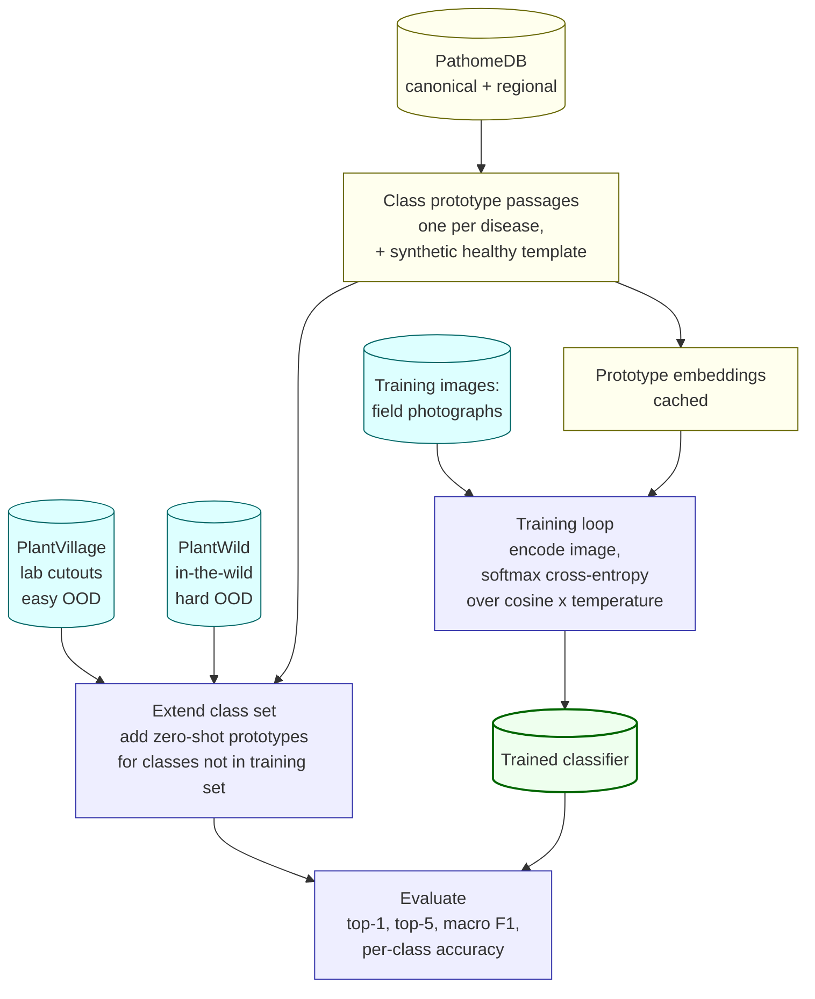
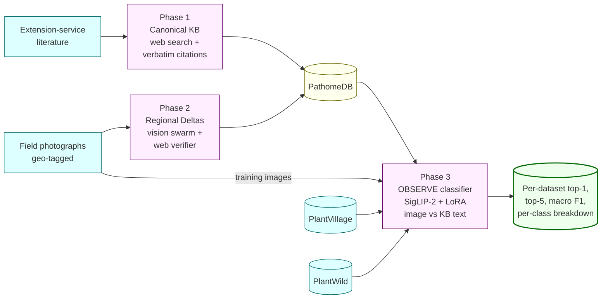

# PathomeDB and the Knowledge-Augmented OOD Classifier — Pipeline Overview

This document is a self-contained walkthrough of the three-stage
pipeline. It is written for a reader who wants to understand *what* is
built and *why*, without reading any source code.

The system has two interlocking deliverables:

1. **PathomeDB** — a plant disease knowledge base that combines
   text-grounded canonical descriptions (from extension-service
   literature) with image-grounded regional observations (from
   field photographs).
2. **OBSERVE** — a small, cheap image classifier whose class labels
   are *defined* by descriptions taken from PathomeDB. The classifier
   is trained on field photographs and evaluated on two
   out-of-distribution image domains.



The next three sections walk through each phase in turn.

---

## Phase 1 — Canonical Knowledge Base

**Goal.** For every (crop, disease) pair in scope, produce one
structured description of the disease that is grounded in
extension-service literature, with a URL and a verbatim quote
supporting every field.

This phase is text-only — no images are touched. The pipeline runs as
three sequential stages, each driven by a large language model with
web search:



The output, per disease, has the following structure (one example):

```jsonc
{
  "disease_name": "Charcoal Rot",
  "pathogen_scientific_name": {
    "value": "Macrophomina phaseolina",
    "url":   "https://extension.umn.edu/.../charcoal-rot-soybean",
    "quote": "Charcoal rot is caused by the soilborne fungus..."
  },
  "type_of_disease":  { "value": "Fungal",   "url": "...", "quote": "..." },
  "affected_parts":   { "value": ["Stem", "Root", "Pod"], "url": "...", "quote": "..." },
  "visual_symptoms": {
    "summary":             { "value": "...", "url": "...", "quote": "..." },
    "diagnostic_features": { "value": "...", "url": "...", "quote": "..." },
    "look_alikes":         { "value": "...", "url": "...", "quote": "..." }
  },
  "treatments": { "value": "...", "url": "...", "quote": "..." }
}
```

Every field carries the URL it came from and the verbatim quote that
supports it. This is the *text-grounded* half of PathomeDB. It is the
same regardless of geography — Charcoal Rot in Iowa has the same
canonical description as Charcoal Rot in Alabama.

---

## Phase 2 — Regional Image-Grounded Deltas

**Goal.** For every (crop, disease, state) tuple that has at least one
field photograph available, identify how the disease *presents in the
field in that state* and emit any image-supported observations that go
beyond what the canonical block already says — additions or
contradictions, never restatements.

This is where geography enters the knowledge base. The same disease
can look different in the field depending on cultivar, climate, soil,
or co-occurring stresses. Canonical text rarely captures this; field
photographs do.

The process for one (crop, disease, state) tuple is a small swarm of
specialist agents that share a vision-language model, plus a
verification step:



A few details worth highlighting:

- **Four specialists run in parallel.** Each owns a different slice
  of the symptom space, so they don't redundantly comment on the same
  field. A fifth agent (the consolidator) deduplicates their outputs
  and drops any "delta" that merely restates the canonical block.
- **Stochastic re-runs and agreement filtering.** The whole pass is
  repeated with different random seeds. A delta only survives if it
  appears in at least *K* out of *N* independent passes — this
  removes per-run hallucinations.
- **External verification.** Every surviving delta is then checked
  against the open web by a separate verifier with web-search access.
  A delta that the verifier finds external support for is marked
  *verified*; one with weak or no support is marked accordingly.
  Only verified or weakly-supported deltas are merged into the KB.
- **Conservative merge.** New deltas are added to the existing
  regional record without overwriting; overlapping deltas increase
  the support count rather than replacing the entry.

The output for one disease, after this phase, looks like:

```jsonc
{
  "disease_name": "Charcoal Rot",
  "canonical": { /* text-grounded block from Phase 1 */ },
  "regional_observations": {
    "Alabama": {
      "deltas": [
        {
          "field": "lesion_morphology",
          "canonical_says": "(not specified)",
          "image_shows": "yellow halos around dark sunken lesions",
          "image_evidence_id": "<photograph id>",
          "swarm_support": 4,
          "verification_status": "verified",
          "web_support": [
            { "url": "https://...", "quote": "..." }
          ]
        }
      ]
    },
    "Iowa": { "deltas": [ /* ... */ ] }
  }
}
```

Together, the canonical block plus all per-state delta sets are what
we call **PathomeDB**. Each disease's entry separates *what is true
of this disease in general* (canonical) from *what is observed of
this disease here* (regional).

---

## Phase 3 — OBSERVE: KB-Augmented OOD Classifier

**Goal.** Build a small, cheap image classifier that holds up under
severe distribution shift. The classifier is trained on field
photographs of one image domain (Bugwood — extension-service field
photos), and evaluated on two completely different image domains
(PlantVillage — controlled studio cutouts; PlantWild — a different
in-the-wild dataset).

The key idea is to make classification *go through* the knowledge
base. Instead of learning a direct mapping from pixels to class
indices, the model learns to embed images into the same space as
text descriptions of diseases, and classifies by similarity. The text
descriptions come from PathomeDB.

### Architecture



The backbone is **SigLIP-2**, a vision-language model that was
pretrained on a very large corpus of image-caption pairs with a
sigmoid contrastive objective. It already knows how to align images
and text in a shared embedding space — we just need to nudge it
toward agricultural imagery and toward the kind of text PathomeDB
emits.

The training scheme is deliberately minimal:

| Component | What we do | Why |
|---|---|---|
| Vision tower (≈400M parameters) | Backbone frozen; **LoRA** adapters added to the query, key, and value projections of the attention layers (≈5M trainable parameters) | A small, low-rank adjustment is enough to specialize for plant disease imagery without forgetting the pretraining |
| Text tower | Frozen, no adaptation | The KB text is already well within the domain SigLIP-2 was pretrained on; touching the text side would risk damaging the alignment |
| Temperature | One learnable scalar (the cosine logit scale) | Lets the model calibrate how peaky its similarity distribution is |
| Class head | None | Classification is done by argmax cosine similarity against text prototypes; no fixed-size class layer means new classes can be added at test time without retraining |

### Class Prototypes

A *class prototype* is a single text passage that describes one
disease in enough detail that the text tower can produce a meaningful
embedding for it. We assemble each prototype from a fixed
template that pulls from PathomeDB:

```
A field photograph of {crop} affected by {disease}
({pathogen scientific name}, {type of disease}).
{canonical summary}.
Diagnostic features: {diagnostic features}.
May be confused with: {look-alikes}.
Affected parts: {affected plant parts}.
Regional variations: {top-K verified deltas across states}.
```

For "healthy" leaves (which the KB does not cover — extension
literature only describes diseases), we use a synthetic template:

```
A healthy {crop} leaf with no visible disease symptoms — uniform
green color, no lesions, no spots, no wilting, no chlorosis,
no necrosis.
```

Every class prototype is encoded **once** by the frozen text tower at
the start of training and cached. Training never re-encodes them.
This is what makes the classifier cheap to train: each minibatch only
runs the vision tower (plus the small LoRA adapters), then a single
matrix multiplication against the cached prototypes.

### Training and Evaluation Flow



What this loop optimizes per minibatch:

```
image_embedding   = vision_tower_with_LoRA(image)           # one vector
prototype_matrix  = (cached text embeddings)                # one row per class
similarity        = exp(temperature) * (image_embedding · prototype_matrix)
loss              = cross_entropy(similarity, true_class_index)
```

At evaluation time, two important behaviors emerge:

- **Open vocabulary.** The test class set is allowed to be *different*
  from the training class set. If PlantVillage includes a disease that
  the model never saw images of during training, we just add its KB
  prototype to the cache. If PlantVillage includes a disease that is
  not in PathomeDB at all, we fall back to a one-line synthetic prompt
  ("A field photograph of {crop} affected by {disease}."). Both kinds
  of new classes can be scored without retraining.
- **Distribution shift is the point.** The training domain
  (Bugwood — geo-tagged field photographs taken by extension workers
  and researchers) is visually very different from the test domains.
  PlantVillage is studio-quality cutouts on uniform backgrounds;
  PlantWild is a separately collected in-the-wild dataset. The
  hypothesis is that a classifier conditioned on KB text
  descriptions is invariant to visual-style shifts in a way that a
  pure-pixel classifier is not, because the disease *identity* is
  carried by the text geometry rather than the pixel statistics.

### What is reported

For each evaluation dataset (PlantVillage, PlantWild), we report:

- **Top-1 accuracy** — fraction of images whose top predicted class
  matches the true class.
- **Top-5 accuracy** — fraction of images whose true class is among
  the top five predictions.
- **Macro F1** — class-balanced F1 across the test classes.
- **Per-class accuracy**, with each class flagged as either
  *KB-known* (its prototype came from a full PathomeDB entry that
  the model saw at training time) or *zero-shot* (the prototype was
  added at evaluation time only).

The split between KB-known and zero-shot classes is what makes this
an honest test of open-vocabulary classification: any uplift the
model shows on zero-shot classes is uplift it gets from the KB text
geometry rather than from having seen images of that class.

---

## End-to-End Summary



In one sentence: Phase 1 builds a text-grounded knowledge base from
extension-service literature, Phase 2 grounds the KB in field
photographs by emitting per-state image-supported additions and
contradictions, and Phase 3 trains a small classifier that uses the
KB descriptions as its class labels and tests whether the resulting
classifier generalizes across two very different out-of-distribution
image domains.
